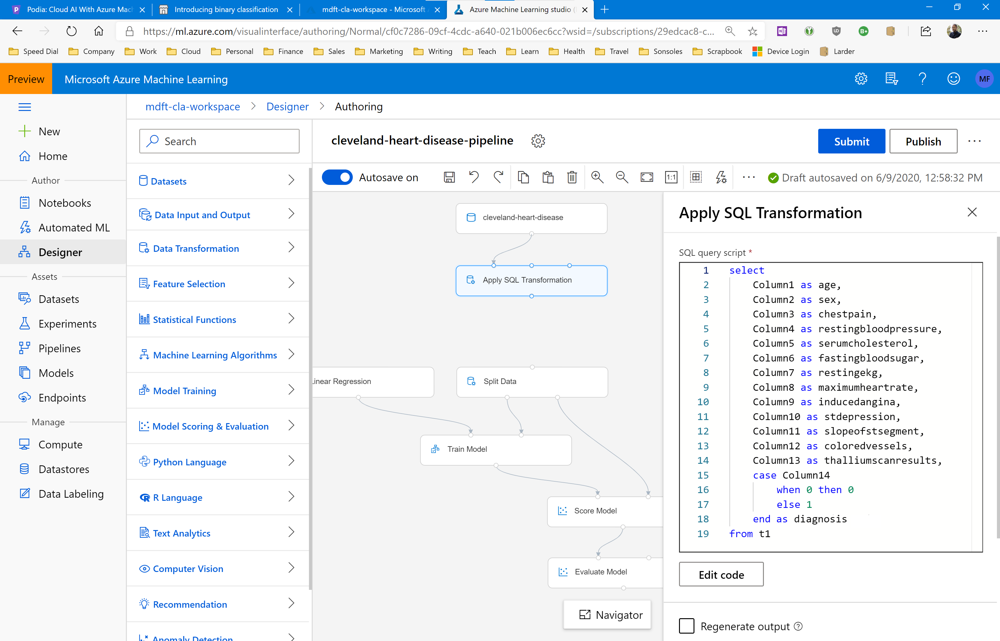

# Assignment: Predict heart disease risk

In this assignment you're going to build an app that can predict the heart disease risk in a group of patients from Cleveland.

The first thing you will need for your app is a data file with patients, their medical info, and their heart disease risk assessment. We're going to use the famous [UCI Heart Disease Dataset](https://archive.ics.uci.edu/ml/datasets/heart+Disease) which has real-life data from 303 patients.

Download the [Processed Cleveland Data](https://archive.ics.uci.edu/ml/machine-learning-databases/heart-disease/processed.cleveland.data) file and save it as **processed.cleveland.data.csv**.

The data file looks like this:


It’s a CSV file with 14 columns of information:

* Age
* Sex: 1 = male, 0 = female
* Chest Pain Type: 1 = typical angina, 2 = atypical angina , 3 = non-anginal pain, 4 = asymptomatic
* Resting blood pressure in mm Hg on admission to the hospital
* Serum cholesterol in mg/dl
* Fasting blood sugar > 120 mg/dl: 1 = true; 0 = false
* Resting EKG results: 0 = normal, 1 = having ST-T wave abnormality, 2 = showing probable or definite left ventricular hypertrophy by Estes’ criteria
* Maximum heart rate achieved
* Exercise induced angina: 1 = yes; 0 = no
* ST depression induced by exercise relative to rest
* Slope of the peak exercise ST segment: 1 = up-sloping, 2 = flat, 3 = down-sloping
* Number of major vessels (0–3) colored by fluoroscopy
* Thallium heart scan results: 3 = normal, 6 = fixed defect, 7 = reversible defect
* Diagnosis of heart disease: 0 = normal risk, 1-4 = elevated risk

The first 13 columns are patient diagnostic information, and the last column is the diagnosis: 0 means a healthy patient, and values 1-4 mean an elevated risk of heart disease.

You are going to build a binary classification machine learning model that reads in all 13 columns of patient information and then makes a prediction for the heart disease risk.

## Before you start

Make sure you have a complete and working California Housing pipeline by following the instructions in the previous assignments. 

We will clone that pipeline and redesign it to train a classification model.

## Getting started

Start by uploading the Heart Disease datafile into Azure.

To save time, you can do this directly in your workspace. You don't have to set up a storage account and a datastore first. 

Just go to the Datasets page in your Azure Machine Learning workspace, click the +Create Dataset button, and then select From Local Files from the dropdown menu:


This will upload the Heart Disease file directly into your workspace, ready for use in a pipeline.

The pipeline for this case study is going to be very similar to the California Housing pipeline you created in the previous lesson. So to get started quickly, simply clone that pipeline: 


Then we only need to make the following changes:

* Replace the dataset module with the Heart Disease dataset
* Alter the data processing modules to perform whatever data processing we need
* Select a classification learning algorithm
* Select the correct label column

## Building a classification pipeline

Let's get started building our classification pipeline.

First, create a new tabular dataset called cleveland-heart-disease and upload the CSV file. Make sure you set all column types to Decimal, and note that this file does not have any column headers.

Now clone the California Housing pipeline. Name the copy cleveland-heart-disease-pipeline. 

Now replace the first module (the dataset) with the heart disease dataset. Also edit the SQL Transformation module and change the SQL statement to this:

```
select 
    Column1 as age,
    Column2 as sex,
    Column3 as chestpain,
    Column4 as restingbloodpressure,
    Column5 as serumcholesterol,
    Column6 as fastingbloodsugar,
    Column7 as restingekg,
    Column8 as maximumheartrate,
    Column9 as inducedangina,
    Column10 as stdepression,
    Column11 as slopeofstsegment,
    Column12 as coloredvessels,
    Column13 as thalliumscanresults,
    case Column14 
        when 0 then 0
        else 1
    end as diagnosis
from t1
```

This SQL statement reintroduces column labels, and also fixes the label column to a pure Boolean value: 0 for healthy patients and 1 for sick patients.

Now remove the Group Into Bins and Convert To Indicator modules.

Your pipeline should now look like this:



All columns in the dataset are already numerical so we can simply load them all directly into a machine learning model for training. But let's do a bit of nornmalization first. 

Open the Data Transformation group and drag a Normalize Data module onto the pipeline canvas. Place the module below the SQL Transformation module. 

Hook the Normalization module up to the Transformation module and the Split module, and configure the module to normalize columns 1 to 11. 


Now open the Machine Learning Algorithms group and drag a Two-Class Logistic Regression algorithm onto the pipeline canvas. Hook the module up to the Train Model module.

Configure the logistic regression module as follows:

* Trainer mode: SingleParameter
* Optimization tolerance: 1e-07
* L2 regularization weight: 1.0
* Random number seed: 123


The last thing you need to do is click on the Train Model module, and set the label column to: diagnosis.


That's it, your pipeline is done.

Run the pipeline in a new experiment, and check out the evaluation results after the run has completed.

## Your results

What results do you get? What is your accuracy, precision, recall, AUC, and F1 value?

Is this dataset balanced? Which metrics should you use to evaluate your model? And what do the values say about the accuracy of your model? 

How could you improve the accuracy of the model? What are your best AUC values? 

Share your results in our Slack homework group!
