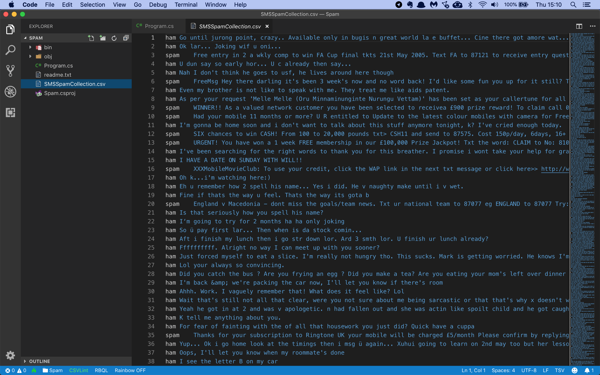
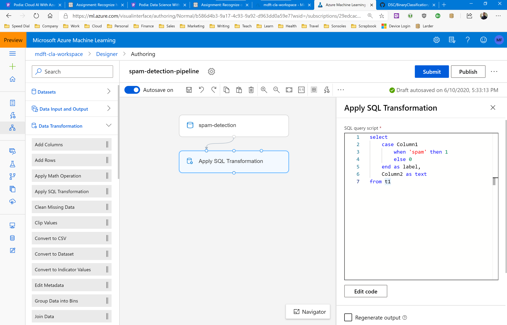
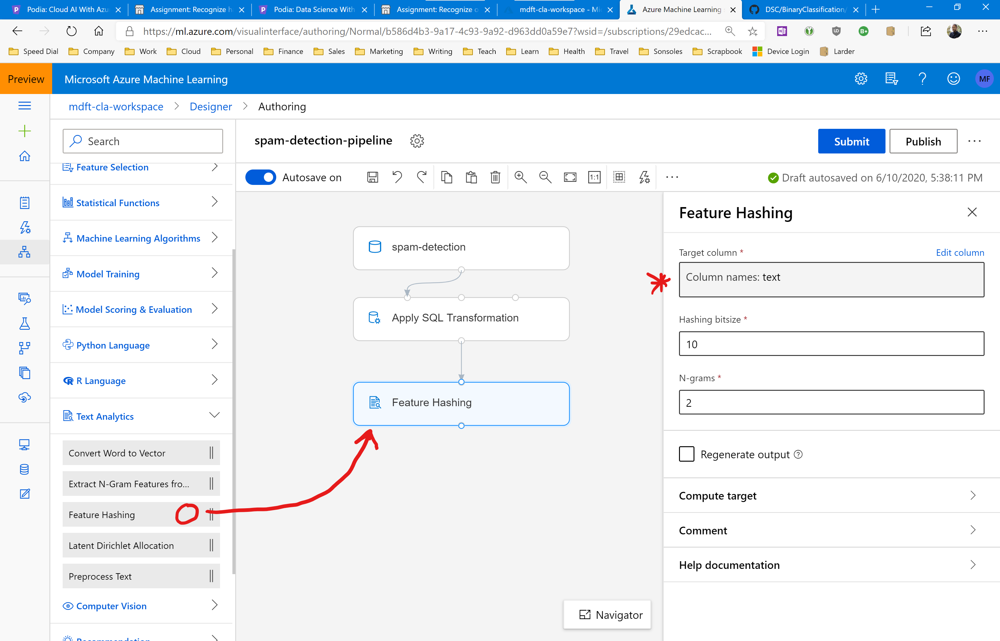
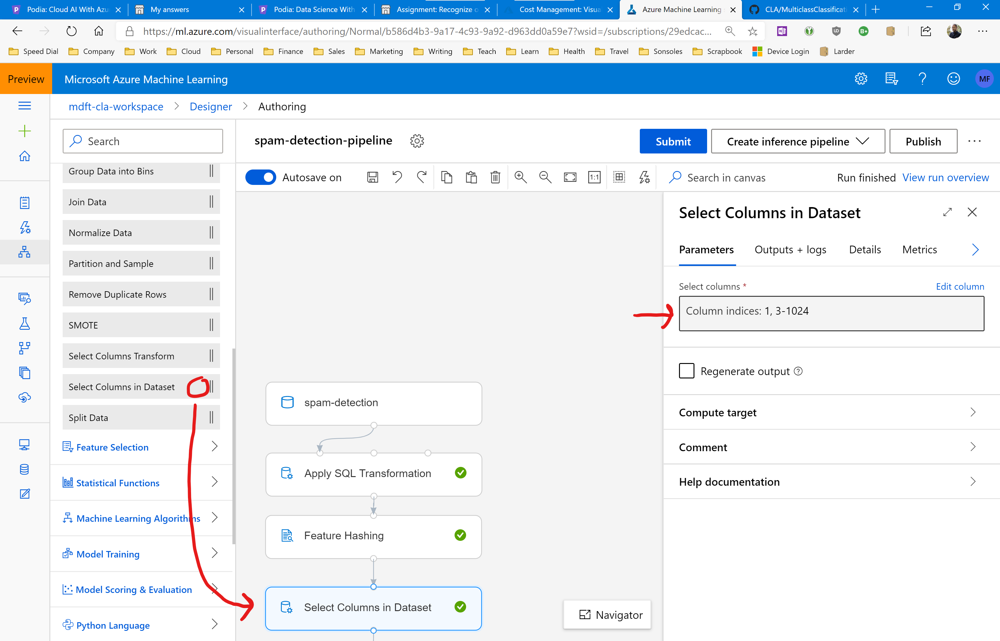
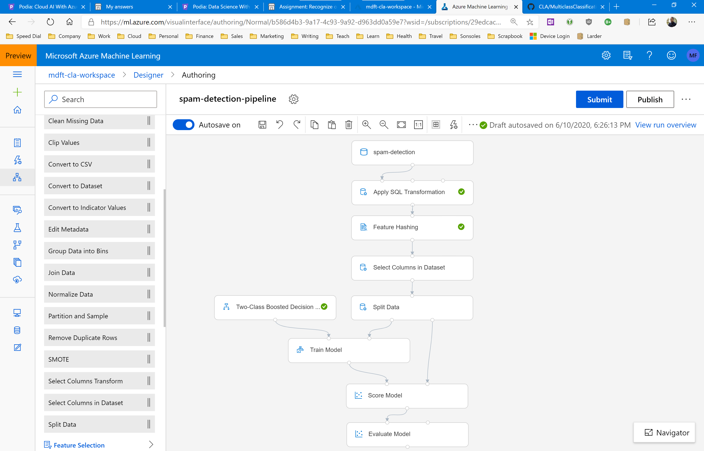

# Assignment: Detect spam SMS messages

In this assignment you're going to build a pipeline that can automatically detect spam SMS messages.

The first thing you'll need is a file with lots of SMS messages, correctly labelled as being spam or not spam. You will use a dataset compiled by Caroline Tagg in her [2009 PhD thesis](http://etheses.bham.ac.uk/253/1/Tagg09PhD.pdf). This dataset has 5574 messages.

Download the [list of messages](https://github.com/mdfarragher/DSC/blob/master/BinaryClassification/SpamDetection/spam.tsv) and save it as **spam.tsv**.

The data file looks like this:



It’s a TSV file with only 2 columns of information:

* Label: ‘spam’ for a spam message and ‘ham’ for a normal message.
* Message: the full text of the SMS message.

You will build a binary classification model that reads in all messages and then makes a prediction for each message if it is spam or ham.

## Building the classification pipeline

Start by uploading the spam datafile into Azure. Make sure to specify that it's a tabular dataset and verify that the tab separator character is correctly detected.

Then create a new pipeline in the Azure Machine Learning designer and drag the spam dataset module onto your pipeline canvas.

Add an Apply SQL Transformation module below, and fill in the following SQL statement:

```
select
    case Column1
        when 'spam' then 1
        else 0
    end as label,
    Column2 as text 
from t1
```

This transformation will add labels to our columns, and convert the first ham/spam column to a numeric 0/1 value. 

Now connect the output of the dataset module to the **leftmost** input of the SQL Transformation module.

Your pipeline should now look like this:



Next, we need to encode the text column to a vector of numbers so that we can train a machine learning model on the data.

Open the Text Analytics group and drag the Feature Hashing module onto the pipeline canvas. Connect it to the previous SQL Transformation module, and in the information panel set the Target column to: text.



There's one more transformation step we need to perform. 

The dataset now contains a label column, the text column, and then 1024 additional columns that represent the sparse vector encoding of the text. 

But we can't train on this dataset yet because the original text is still in there. We need to get rid of that column now, because we only need the sparse vector encoding to train the machine learning model.

So, open the Data Transformation group and drag the Select Columns In Dataset module onto the pipeline designer. Place the module between the Feature Hasing and Split Data modules.

Configure the module to select columns by indices, and specify the indices: 1, 3-1024.

This will keep all columns except column 2 which contains the original SMS text. 



Now continue the pipeline in the usual manner. Split the data 80/20 and use the 80% set for training. 

Score the model with the 20% test set and evaluate the scored predictions to calculate performance metrics.

Make sure you use the Two-Class Boosted Decision Tree algorithm for training the model. Decision trees are fast and really good at binary text classification. 

We will cover decision trees in depth in a later section.

Your pipeline should look like this:



That's it, your pipeline is done.

Run the pipeline in a new experiment, and check out the evaluation results after the run has completed.

## Your results

What results do you get? What is your accuracy, precision, recall, AUC, and F1 value?

Is this dataset balanced? Which metrics should you use to evaluate your model? And what do the values say about the accuracy of your model? 

How could you improve the accuracy of the model? What are your best AUC values? 

Share your results in our Slack homework group!
