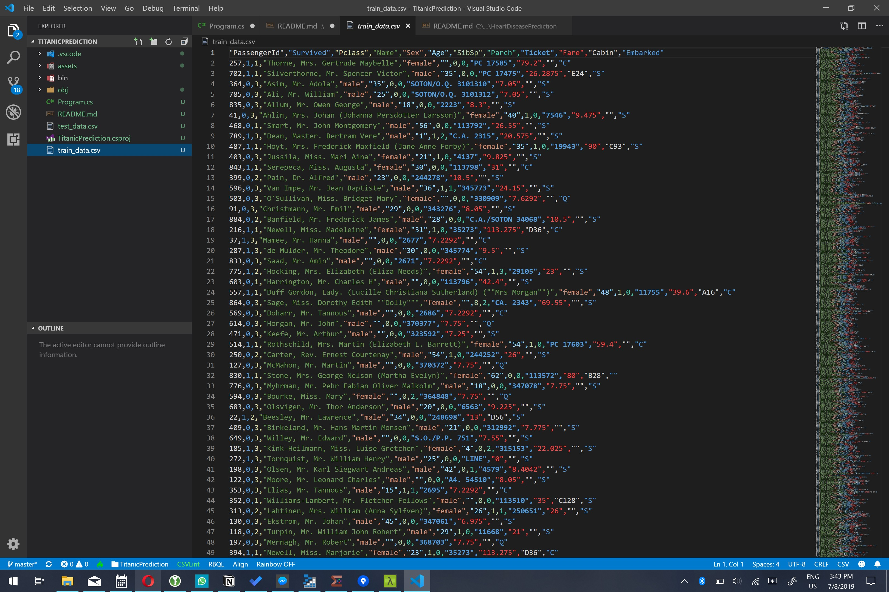
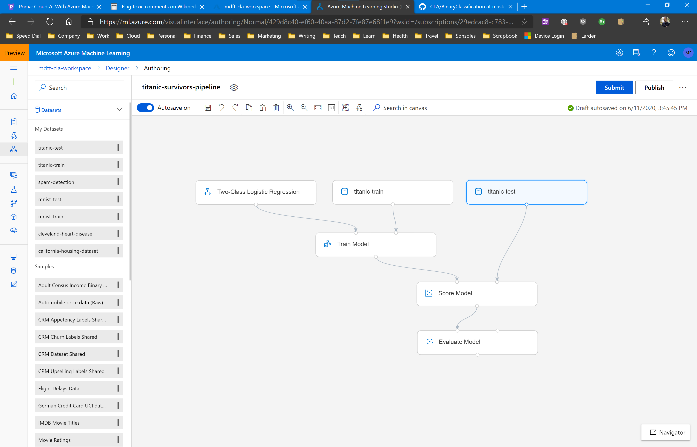
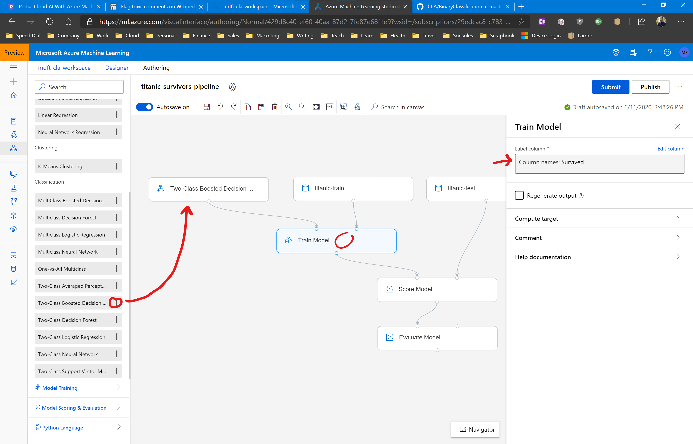

# Assignment: Predict who survived the Titanic disaster

The sinking of the RMS Titanic is one of the most infamous shipwrecks in history. On April 15, 1912, during her maiden voyage, the Titanic sank after colliding with an iceberg, killing 1502 out of 2224 passengers and crew. This sensational tragedy shocked the international community and led to better safety regulations for ships.

In this assignment you're going to build a model that can predict which Titanic passengers survived the disaster. You will use a decision tree classifier to make your predictions.

The first thing you will need for your app is the passenger manifest of the Titanic's last voyage. You will use the famous [Kaggle Titanic Dataset](https://github.com/sbaidachni/MLNETTitanic/tree/master/MLNetTitanic) which has data for a subset of 891 passengers.

Download the [test_data](https://github.com/mdfarragher/CLA/blob/master/BinaryClassification/TitanicPrediction/test_data.csv) and [train_data](https://github.com/mdfarragher/CLA/blob/master/BinaryClassification/TitanicPrediction/train_data.csv) files and upload them into Azure Machine Learning as new datasets.

The training and testing files look like this:

These are CSV files with 12 columns of information:

* The passenger identifier
* The label column containing ‘1’ if the passenger survived and ‘0’ if the passenger perished
* The class of travel (1–3)
* The name of the passenger
* The gender of the passenger (‘male’ or ‘female’)
* The age of the passenger, or ‘0’ if the age is unknown
* The number of siblings and/or spouses aboard
* The number of parents and/or children aboard
* The ticket number
* The fare paid
* The cabin number
* The port in which the passenger embarked

The second column is the label: 0 means the passenger perished, and 1 means the passenger survived. All other columns are input features from the passenger manifest.

You're gooing to build a binary classification model that loads all columns and predicts for each passenger if he or she survived.

## Building the classification pipeline

Start by uploading the datafiles into Azure. 

The pipeline for this case study is going to be very similar to the Cleveland Heart Disease pipeline you created earlier. Both pipelines are binary classifiers that work on numerical data.

So to get started quickly, simply clone that pipeline. Then replace the heart disease dataset with the Titanic training dataset.

Remove the SQL Transformation, Normalize Data, and Split Data modules. 

Connect the training dataset directly to the **rightmost** input of the Train Model module.

Now drag the Titanic testing dataset onto the pipeline canvas and connect it to the **rightmost** input of the Score Model module.

Your pipeline should now look like this:

Now replace the Two Class Logistic Regression with the Two-Class Boosted Decision Tree module.

Finally, click on the Train Model module and set the label column to: Survived.

Run the pipeline in a new experiment, and check out the evaluation results after the run has completed.

## Results

What results do you get? What is your accuracy, precision, recall, AUC, AUCPRC, and F1 value?

Is this dataset balanced? Which metrics should you use to evaluate your model? And what do the values say about the accuracy of your model? 

Take a look at the individual columns in the dataset. Do any columns require further processing? Does you result improve if you add these processing steps to the pipeline? 

Do you think a decision tree is a good choice to predict Titanic survivors? Which other algorithms could you use instead? Do they give a better result?

Share your results in our group!
