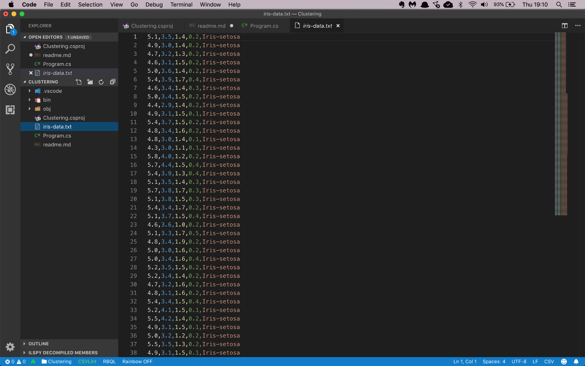

# Assignment: Cluster Iris flowers

In this assignment you are going to build an unsupervised learning pipeline that clusters Iris flowers into discrete groups. 

There are three types of Iris flowers: Versicolor, Setosa, and Virginica. Each flower has two sets of leaves: the inner Petals and the outer Sepals.

Your goal is to build an app that can identify an Iris flower by its sepal and petal size.

Your challenge is that you're not going to use the dataset labels. Your pipeline has to recognize patterns in the dataset and cluster the flowers into three groups without any help. 

Clustering is an example of unsupervised learning where the data science model has to figure out the labels on its own. 

The first thing you will need is a data file with Iris flower petal and sepal sizes. You can use this [CSV file](https://github.com/mdfarragher/CLA/blob/master/Clustering/IrisFlower/iris-data.csv). Upload it into your Azure Machine Learning workspace as a new dataset.

The file looks like this:

It’s a CSV file with 5 columns:

* The length of the Sepal in centimeters
* The width of the Sepal in centimeters
* The length of the Petal in centimeters
* The width of the Petal in centimeters
* The type of Iris flower

You are going to build a clustering model that reads the data and then guesses the label for each flower in the dataset.

Of course the app won't know the real names of the flowers, so it's just going to number them: 1, 2, and 3.

Let’s get started. 

## Building the clustering pipeline

Start by uploading the datafile into your Azure Machine Learning workspace as a new dataset. Make sure you specify the correct field delimiter and column datatypes.

Now create a new pipeline, and drag the Iris flower dataset onto the design surface. 

We're not going to split the dataset 80/20 for training and scoring, so we can put a training module in next. But because this is a clustering exercise, we need a special module called Train Clustering Model. 

Drag the Train Clustering Model from the Model Training panel onto the design surface and connect its **rightmost** input to the dataset.

Now open the Machine Learning Algorithms panel and drag the K-Means Clustering module onto the design surface. Connect it to the **leftmost** input of the Train Clustering Model module.

Configure the K-Means algorithm as follows:

* Create trainer mode: SingleParameter
* Number of centroids: 3
* Initialization: K-Means++
* Random number seed: 123
* Metric: Euclidian
* Normalize features: checked
* Iterations: 100
* Assign label mode: Ignore label column

Now click the Train Clustering Model module and configure it as follows:

* Column Set: Column Indices 1-4.

This will cluster the data on sepal and petal sizes, and append the cluster ID to the end of the dataset as a new column. We can compare the generated cluster ID with the dataset label to see how accurate the clustering has been. 

Let's export the clustered dataset so we can inspect it after running the pipeline. 

Open the Data Input And Output panel and drag the Export Data module on the design surface. Connect it to the **rightmost** output of the Train Clustering Model module. 

Configure the export module as follows:

* Datastore type: Azure Blob Storage
* Datastore: workspaceblobstore
* Path: iris/output.csv
* File format: csv

This will save the clustered dataset to the CSV file **output.csv** in the container **iris**. 

That's it, the pipeline is done.

Run the pipeline in a new experiment, and check out the results after the run has completed.

## Results

Open the output file and check the predictions for every flower. How often does the model get it wrong? Which Iris types are the most confusing to the model?

Share your results in our Slack group. 