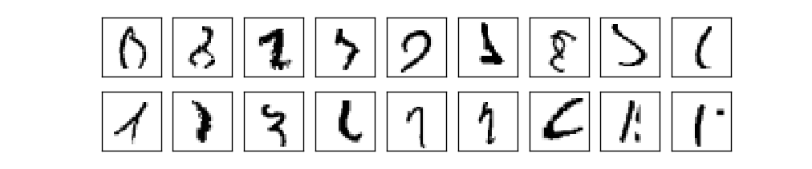
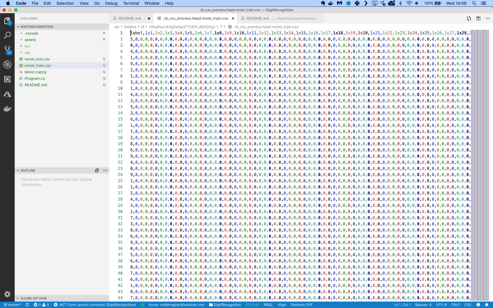

# Assignment: Recognize handwritten digits

In this assignment, You are going to build a pipeline that recognizes handwritten digits from the famous MNIST machine learning dataset:

Your pipeline must load these images of handwritten digits and correctly predict which digit is visible in each image.

This may seem like an easy challenge, but look at this:

These are a couple of digits from the dataset. Are you able to identify each one? It probably won’t surprise you to hear that the human error rate on this exercise is around 2.5%.

The first thing you will need is a data file with images of handwritten digits. We will not use the original MNIST data because it's stored in a nonstandard binary format.

Instead, we'll use these excellent [CSV files](https://www.kaggle.com/oddrationale/mnist-in-csv/) prepared by Daniel Dato on Kaggle.

Create a Kaggle account if you don't have one yet, then download **mnist_train.csv** and **mnist_test.csv** and save them in your project folder.

There are 60,000 images in the training file and 10,000 in the test file. Each image is monochrome and resized to 28x28 pixels.

The training file looks like this:

It’s a CSV file with 785 columns:

* The first column contains the label. It tells us which one of the 10 possible digits is visible in the image.
* The next 784 columns are the pixel intensity values (0..255) for each pixel in the image, counting from left to right and top to bottom.

You are going to build a pipeline that trains a multiclass classification machine learning model on the training data and then makes a prediction for each digit in the test dataset.

## Before you start

Make sure you have a complete and working Cleveland Heart Disease pipeline by following the instructions in the previous assignments. 

We will clone that pipeline and redesign it to train a multiclass classification model.

## Getting started

Start by uploading the MNIST datafile into Azure.

Since we have separate training and testing datafiles, you need to upload them separately into two distinct datasets. If you try to upload them together, Azure Machine Learning will glue the files together and treat them as one large dataset.

So upload the files separately and create the following datasets:

* mnist-train (with training data)
* mnist-test (with testing data)

The pipeline for this case study is going to be very similar to the Cleveland Heart Disease pipeline you created in the previous lesson. So to get started quickly, simply clone that pipeline. 

Then you only need to make the following changes:

* Replace the dataset modules
* Replace the data processing modules
* Use a multiclass classification learning algorithm
* Select the correct label column

## Building a multiclass classification pipeline

Let's get started building our multiclass classification pipeline.

First, make sure you have uploaded the MNIST training and testing files into new tabular datasets. The files have column headers so make sure to select that option during the upload. Also check that all columns are imported as integers.

Then clone the California Housing pipeline. Name the copy mnist-pipeline. 

In the pipeline designer, delete the heart disease dataset and replace it with the two MNIST training and testing datasets. 

Also delete the SQL Transformation and Normalization modules. We will not perform any data processing in this pipeline.

Connect the output of the training dataset to the **rightmost** input of the Train Model module, and connect the output of the testing dataset to the **rightmost** input of the Score Model module. 

Your pipeline should now look like this:

We're almost done. 

Now remove the Two-Class Logistic Regression module, and replace it with a Multiclass Logistic Regression module. 

Connect the multiclass logistic regression output to the **leftmost** input of the Train Model module.

Configure the multiclass regression as follows:

* Trainer mode: SingleParameter
* Optimization tolerance: 1e-07
* L2 regularization weight: 1.0
* Random number seed: 123

Now select the Train Model module and set the label column to: label.

That's it, your pipeline is done.

## Set up a GPU cluster

Unfortunately the MNIST dataset is too large to run on our basic D1 compute cluster, so we're going to have to quickly provision some heavy duty hardware.

Go to the Compute page in Azure ML Studio and select the Compute Clusters tab. 

Click the +New button, and add the following cluster:

* Compute name: [choose a name for the cluster]
* Virtual machine type: GPU
* Virtual machine priority: Low priority
* Virtual machine size: Standard_NC6
* Minimum number of nodes: 0
* Maximum number of nodes: 2
* Idle seconds...: 120

Click the blue Create button and wait until the cluster is up and running. 

Then switch back to the pipeline canvas, click the gear icon at the top of the page, and in the information panel switch the pipeline over to the new compute cluster.

Now run the pipeline in a new experiment, and check out the evaluation results after the run has completed.

## Your results

What results do you get? What is your overall accuracy and your micro- and macro precision and recall? 

Do you think the dataset is balanced? 

What can you say about the accuracy? Is this a good model? How far away are you from the human accuracy rate? Is this a superhuman or subhuman AI? 

Think about the pipeline in this assignment. How could you improve the accuracy of the model even further?

Share your results in our Slack group!

## Cleaning up

The NC6 virtual machines are expensive to run, so make sure to delete the GPU cluster after you have completed this assignment!

If you keep the cluster running, you will very quickly spend all of your free Azure credits and your account will be disabled. 