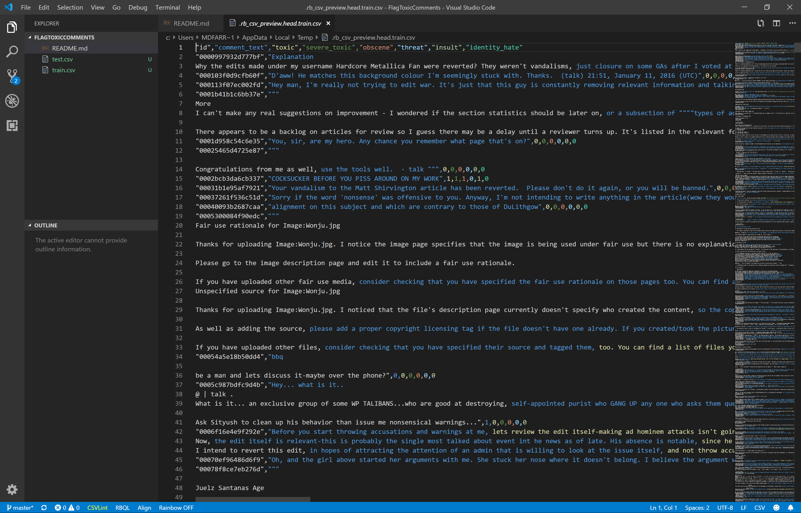
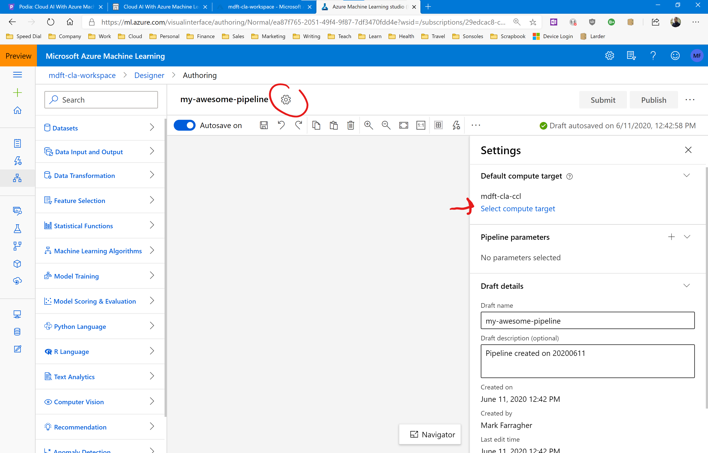

# The case

Moderating online discussions about things people care about can be difficult. The threat of abuse and harassment means that many people stop expressing themselves and give up on seeking different opinions. Many platforms struggle to effectively facilitate conversations, leading many communities to limit or completely shut down user comments.

The **Conversation AI** team is a research initiative founded by Jigsaw and Google. It is working on tools to help improve online conversation. One area of focus is the study of negative online behaviors, like toxic comments that are rude, disrespectful or likely to make someone leave a discussion. 

The team has built a range of public tools to detect toxicity. But the current apps still make errors, and they don’t allow users to select which types of toxicity they’re interested in finding.

In this case study, you’re going to build an app that is capable of detecting different types of of toxicity like threats, obscenity, insults, and hate. You’ll be using a dataset of comments from Wikipedia’s talk page edits.

How accurate will your app be? Do you think you will be able to flag every toxic comment? 

# The dataset

In this case study you'll be working with a dataset containing over 313,000 comments from Wikipedia talk pages. 

There are two files in the dataset:
* [train.csv](https://www.kaggle.com/c/jigsaw-toxic-comment-classification-challenge/download/train.csv) which contains 160k records, 2 input features, and 6 output labels. You will use this file to train your model.
* [test.csv](https://www.kaggle.com/c/jigsaw-toxic-comment-classification-challenge/download/test.csv) which contains 153k records and 2 input features. You will use this file to test your model.

You'll need to [download the dataset from Kaggle](https://www.kaggle.com/c/8076/download-all) to get started. [Create a Kaggle account](https://www.kaggle.com/account/login) if you don't have one yet. 

Here's a description of all columns in the training file:
* **id**: the identifier of the comment
* **comment_text**: the text of the comment
* **toxic**: 1 if the comment is toxic, 0 if it is not
* **severe_toxic**: 1 if the comment is severely toxic, 0 if it is not
* **obscene**: 1 if the comment is obscene, 0 if it is not
* **threat**: 1 if the comment is threatening, 0 if it is not
* **insult**: 1 if the comment is insulting, 0 if it is not
* **identity_hate**: 1 if the comment expresses identity hatred, 0 if it does not

## Set up a GPU cluster

This assignment features a lot of training data which migh be too much for our basic D1 compute cluster. To speed up the pipeline we're going to have to quickly provision some heavy duty hardware.

Go to the Compute page in Azure ML Studio and select the Compute Clusters tab. 

Click the +New button, and add the following cluster:

* Compute name: [choose a name for the cluster]
* Virtual machine type: GPU
* Virtual machine priority: Low priority
* Virtual machine size: Standard_NC6
* Minimum number of nodes: 0
* Maximum number of nodes: 2
* Idle seconds...: 120

Click the blue Create button and wait until the cluster is up and running. 

Then when you create your training pipeline, click the gear icon at the top of the page, and in the information panel switch the pipeline over to the new compute cluster.

Your pipeline will now run on the new cluster. This can make your training time up to 100x faster. 

# Your assignment
Your assignment is to build a pipeline that loads the training and testing files and featurizes the comments to prepare them for analysis.

Then train a multiclass classifier on the training data and generate predictions for the comments in the testing file. 

Measure the overall accuracy and the micro- and macro precision and recall. Report your best values in our group.

See if you can get the accuracies as close to 1 as possible. Share in our group how you did it. Which learning algorithm did you select, and how did you configure your model? 

Good luck!

## Cleaning up

The NC6 virtual machines are expensive to run, so make sure to delete the GPU cluster after you have completed this assignment!

If you keep the cluster running, you will very quickly spend all of your free Azure credits and your account will be disabled. 
