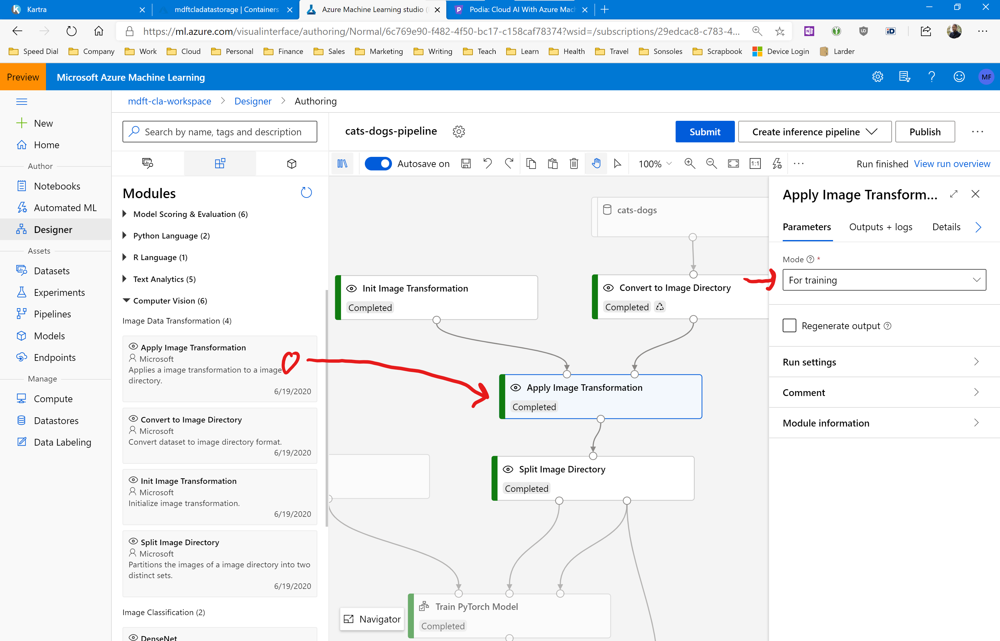
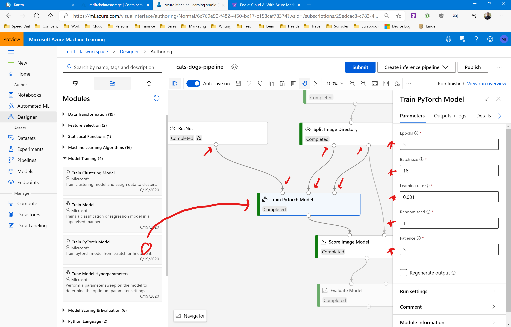

# Assignment: Recognize cats and dogs

In this assignment you are going to build an app which must be able to identify cats and dogs in any image. 

The easiest way to do this is to build a neural network and train it on a dataset of cat and dog images. The **Kaggle cats and dogs** dataset has exactly what we need.

You can [download the dataset](https://www.dropbox.com/s/dnhezyz3g6i8s88/catsanddogs2.zip?dl=1) from my DropBox account. Save the archive in a local folder but make sure you DO NOT unzip the file. You won't need to becasue Azure Machine Learning Studio can work with zipped training files directly.

Here's what the dataset looks like:

These are 2000 pictures of cats. We also have a second set with 2000 images of dogs. The zipped file is slightly over 100 MB in size.

You are going to train a neural network on these image sets and get the cat and dog detection accuracy as high as possible.

Let’s get started. 

## Prepare the dataset

The first thing you need to do is upload the cats and dogs files into Azure Machine Learning as a new dataset. 

Open the Azure Machine Learning Studio and navigate to the datasets list. Create a new dataset and make sure to specify the following details:

* Name: cats-and-dogs
* Dataset type: File

Click the blue Next button and then select the **catsanddogs2.zip** file you downloaded earlier. 

Click the blue Next button and confirm your new dataset.

You now have all 4000 images of cats and dogs uploaded in Azure Machine Learning and ready for training a deep neural network. 

But before we start building the training pipeline, we need to do one more thing.

## Set up a GPU training cluster

This assignment features a lot of training data which migh be too much for our basic D1 compute cluster. To speed up the pipeline we're going to have to quickly provision some heavy duty hardware.

Go to the Compute page in Azure ML Studio and select the Compute Clusters tab. 

Click the +New button, and add the following cluster:

* Compute name: [choose a name for the cluster]
* Virtual machine type: GPU
* Virtual machine priority: Low priority
* Virtual machine size: Standard_NC6
* Minimum number of nodes: 0
* Maximum number of nodes: 2
* Idle seconds...: 120

Click the blue Create button and wait until the cluster is up and running. 

Then when you create your training pipeline, click the gear icon at the top of the page, and in the information panel switch the pipeline over to the new compute cluster.

Your pipeline will now run on the new cluster. This can make your training time up to 100x faster. 

But keep in mind that training on images is a very heavy-duty machine learning task. Even with this beefed-up cluster, training a deep neural network on our 4000 images is going to take at least an hour!

## Building the training pipeline

Open the Azure Machine Learning Designer and create a new pipeline. Don't forget to set the compute cluster to the new GPU cluster you just created.

Then open the datasets group and drag the cats-and-dogs dataset onto your designer canvas:

This is the file dataset containing our 4000 cat and dog images. But we can't train on this dataset yet. We first need to convert it to an **image directory**: a specialized datastructure for training machine learning models on image collections.

The cats and dogs dataset stores all cat images in a folder named **/cat/** and all dog images in a folder named **/dog/**. Azure Machine Learning has built-in support for this kind of directory structure and will automatically treat the folders as labels.

When we create an image directory, Azure will correctly label each image and then randomize the set so that the neural network alternately sees a random cat and then a random dog during training. This setup minimizes the risk of bias. 

Let's set this up. Open the Computer Vision group and drag the Convert To Image Directory module onto the pipeline canvas. Then connect the dataset to the Image Directory module:

You don't need to configure the Image Directory module. It will automatically scan the zip file, recognize the directory structure, and create a training set with all the images correctly labelled.

Our next step is to resize all images. Deep neural networks can only train on images that are all the same size. But our cats and dogs dataset has images with all kinds of different sizes and orientations. So we need to resize each image to a common baseline. 

Drag the Init Image Transformation module from the Computer Vision group onto the designer canvas. Configure it as follows:

* Resize: True
* Size: 256
* Center crop: True
* Crop size: 224
* Pad: False
* Color jitter: unchecked
* Grayscale: unchecked
* Random resized crop: False
* Random crop: False
* Random horizontal flip: unchecked
* Random vertical flip: unchecked
* Random rotation: False
* Random affine: False
* Random grayscale: unchecked
* Random perspective: unchecked

This will resize each image to 256x256 pixels and then crop the images using a 224x224 box from the center of the image.

Now we need to apply this image transformation to the image directory. 

Drag an Apply Image Transformation module from the Computer Vision group to the designer canvas. Connect its **leftmost** input to the Init Image Transformation module and its **rightmost** input to the Convert To Image Directory module. 

Configure the module as follows:

* Mode: For training

Now we're going to split the image directory. We'll reserve 80% of the images for training and 20% of the images for testing. 

We can't use the regular split module because it can't operate on image directories. But fortunately there's a specialized module in the computer vision group that can handle splitting image directories. 

Drag the Split Image Directory module from the Computer Vision group onto the designer canvas. Connect its input to the Apply Image Transformation module.

Then configure the split as follows:

* Fraction of images in the first output: 0.8

We're going to use a trick for this assignment. Instead of training a deep neural network from scratch, we're going to grab a **pretrained** neural network from the Internet and retrain it on our dog and cat pictures. This process is called **fine-tuning** and it's a very popular technique to very quickly build an object detector. 

We will use the ResNet neural network in this assignment. This machine learning model is available out of the box in Azure Machine Learning Studio. 

Drag the ResNet module from the Computer Vision group onto the designer canvas. Configure it as follows:

* Model name: resnetx101_32x8d
* Pretrained: checked

The important setting here is **pretrained**. This tells Azure ML to download the pretrained neural network from the Internet and use it for our cat and dog challenge. This will dramatically reduce our training time.

ResNet is a PyTorch model, so we need a specialized training module to train this Python model on the image directory. 

Open the Model Training group and drag the Train PyTorch Model module on the designer canvas. Connect its **leftmost** input to the ResNet module, its **middle** input to the **leftmost** output of the Split Image Directory module, and its **rightmost** input to the **rightmost** output of the Split Image Directory Module. 

Then configure the module as follows:

* Epochs: 5
* Batch size: 16
* Learning rate: 0.001
* Random seed: 1
* Patience: 3

We now have a fully-trained PyTorch neural network capable of detecting cats and dogs in images. All that remains is to score the network on the test data and evaluate the model metrics. 

Open the Model Scoring & Evaluation group and drag the Score Image Model module onto the designer canvas. Connect it to the Train PyTorch module. 

Then drag the Evaluate Model module onto the canvas and connect it to the Score Image Model module.

The evaluation module will treat this as a multiclass classification problem and calculate the accuracy and micro- and macro precision and recall. 

Your completed pipeline should now look like this:

Run the pipeline in a new experiment, and check out the evaluation results after the run has completed.

## Your results

What results do you get? What is your overall accuracy and your micro- and macro precision and recall? 

Are you happy with these results?

Share your results in our Slack group!

## Cleaning up

The NC6 virtual machines are expensive to run, so make sure to delete the GPU cluster after you have completed this assignment!

If you keep the cluster running, you will very quickly spend all of your free Azure credits and your account will be disabled. 
