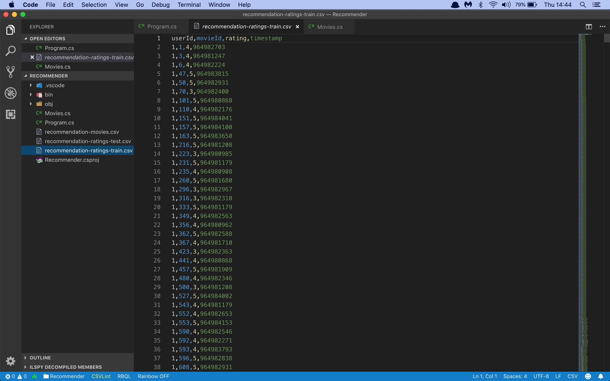
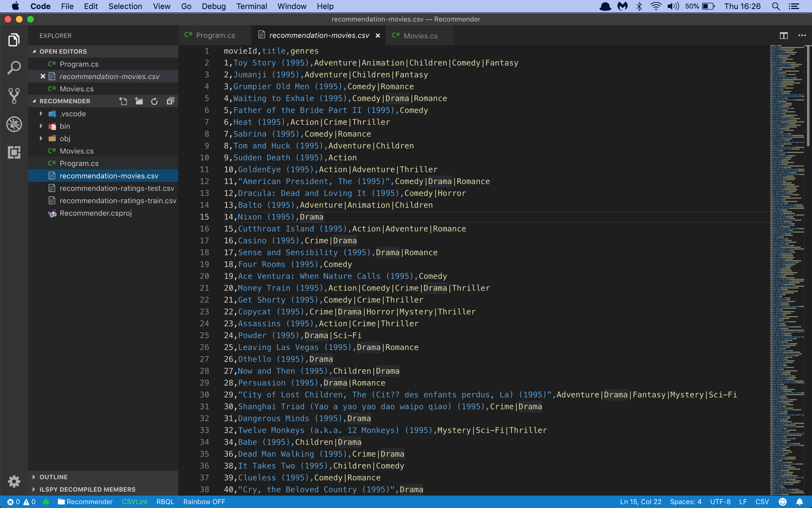
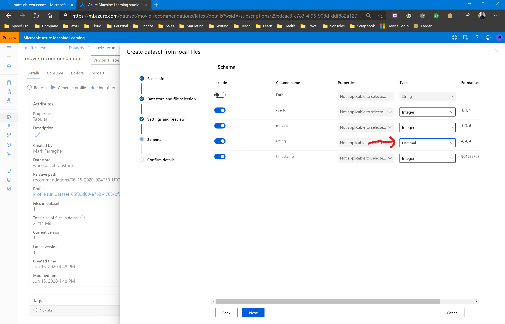
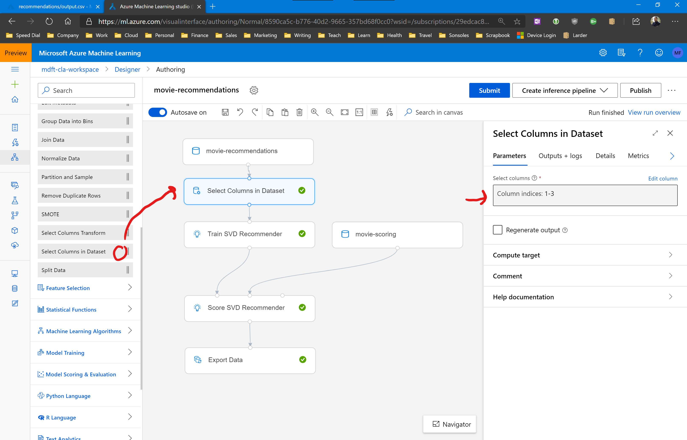
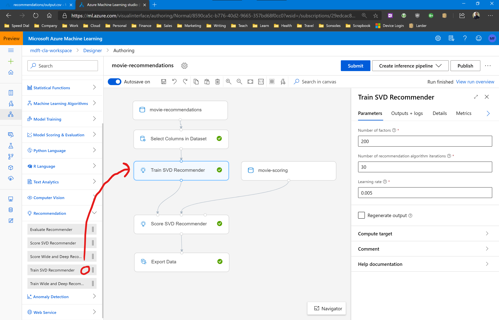
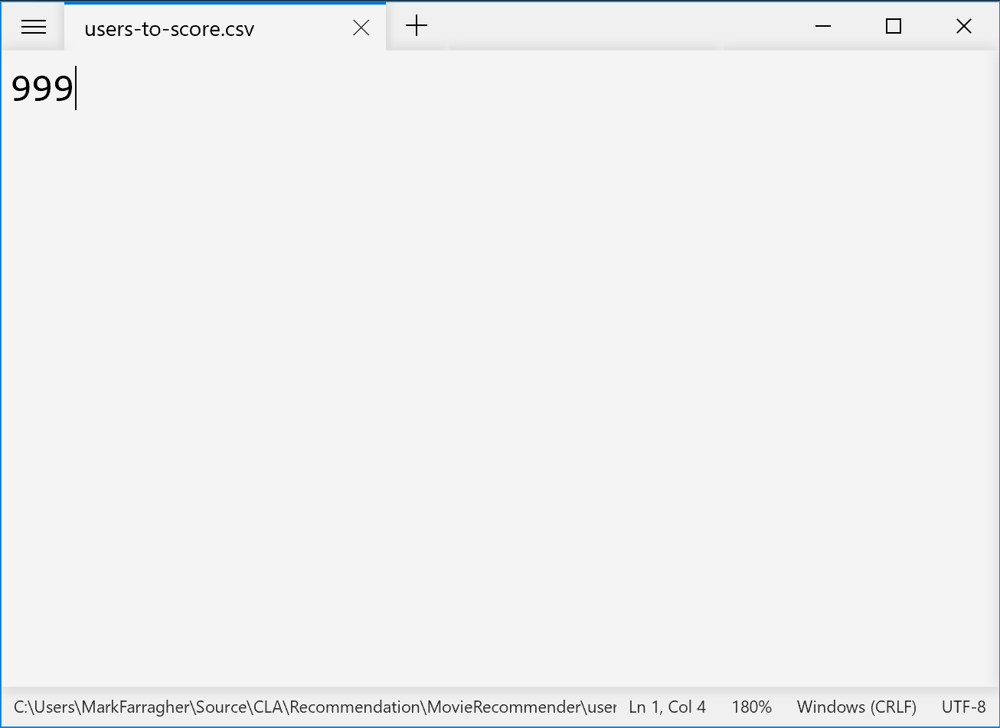
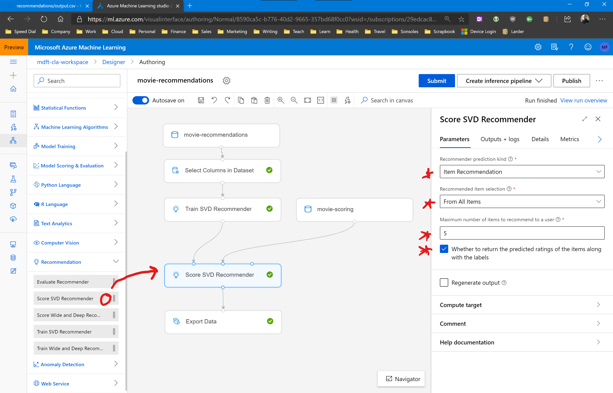
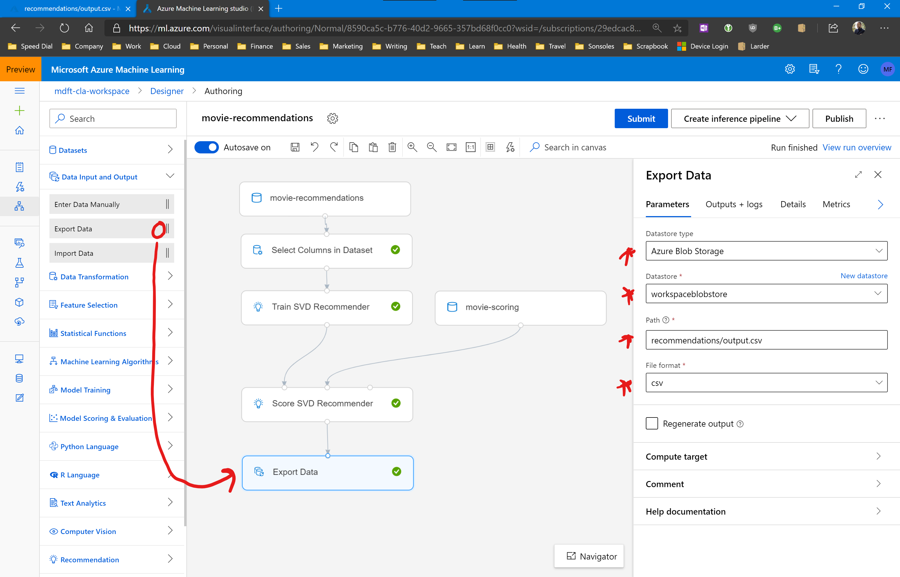

# Assignment: Recommend new movies to film fans

In this assignment you're going to build a movie recommendation system that can recommend new movies to film fans.

The first thing you'll need is a data file with thousands of movies rated by many different users. The [MovieLens Project](https://movielens.org) has exactly what you need.

Download the [movie ratings](https://github.com/mdfarragher/CLA/blob/master/Recommendation/MovieRecommender/recommendation-ratings.csv) and the [movie dictionary](https://github.com/mdfarragher/CLA/blob/master/Recommendation/MovieRecommender/recommendation-movies.csv) and save these files locally. You now have almost 100,000 movie ratings for training. 

The rating file is in CSV format and looks like this:

There are only four columns of data:

* The ID of the user
* The ID of the movie
* The movie rating on a scale from 1–5
* The timestamp of the rating

The movie dictionary file is also in CSV format and maps each movie ID to a title:

You are going to build a pipeline that reads in all ratings, trains a recommendation model on the data, and then uses the trained model to generate movie recommendations for any user.

Let’s get started. 

## Building the recommendation pipeline

Start by uploading the rating datafile into your Azure Machine Learning workspace as a new dataset. Make sure you specify the correct field delimiter.

Keep an eye on the column datatypes! Some movie ratings are fractional values like 1.5, 2.5 etc. So make sure you specify the Decimal datatype for the rating column when you're importing the dataset:

Next, create a new pipeline and drag the rating dataset onto the design surface. 

The dataset contains an extra column at the end called Timestamp. We don't need this column for the recommendation training, and in fact its presence will crash the training process.

So let's get rid of that column now. 

Open the Data Transformation group and drag the Select Columns In Dataset module onto the design surface. Connect it to the dataset, and then configure the module as follows:

* Select columns: Column indices 1-3

This will select only the first three columns and exclude the final Timestamp column from training. 

We're don't need to split the dataset 80/20 for training and scoring, so we can put a training module in next. But because this is a recommendation exercise, we need a special module called Train SVD Recommender. 

Drag the Train SVD Recommender from the Recommendation group onto the design surface and connect it to the dataset.

You don't have to configure anything. The SVD Recommender expects the data to consist of three columns: a user ID, an item ID, and a rating score. Our dataset has exactly this format, so we don't need to transform anything. 

That's it, you'll now have a fully trained recommendation model on the output side of this module. 

So let's have some fun. 

I am also in the dataset, my user ID is 999. We are now going to use the fully-trained model to generate 5 movie recommendations for me. 

To do this, you're going to need a new dataset with the user IDs of all the users you want to generate recommendations for. 

As we're only talking about me, you'll need a file with only a single column (the user ID) and only a single record (my user ID, which is 999). 

So open notepad now and create a new CSV file with only the text '999', like this:

Upload this file into your Azure Machine Learning workspace as a new tabular dataset. 

Now drag this new dataset onto your design surface. 

From the Recommendation group, drag the Score SVD Recommender module onto the design surface. Connect the **leftmost** input to the Train SVD Recommender module, and the **rightmost** input to the new dataset with the number 999. 

Configure the Score SVD Recommender module like this:

* Recommender prediction kind: Item Recommendation
* Recommended item selection: From All Items
* Maximum number of items to recommend to a user: 5
* Wether to return the predicted ratings...: checked

The output of the scoring module will now contain a list of 5 movies recommended to user 999 (which is me).

Let's export that data to a new CSV file. From the Data Input And Output group, drag a new Export Data module to the canvas and connect it to the Score SVD Recommender. 

Configure the Export Data module like this:

* Datastore type: Azure Blob Storage
* Datastore: workspaceblobstore
* Path: recommendations/output.csv
* File format: csv

This will save the movie recommendations to the CSV file **output.csv** in the container **recommendations**. 

That's it, the pipeline is done.

Run the pipeline in a new experiment, and check out the results after the run has completed.

## Results

So what are your results? What are my 5 favorite movies according to the recommendation model? Use the other movie CSV file with all the movie titles to map the recommended movie IDs to their corresponding title values.

Post your results in our Slack group and then ask me if the predictions are correct ;)
