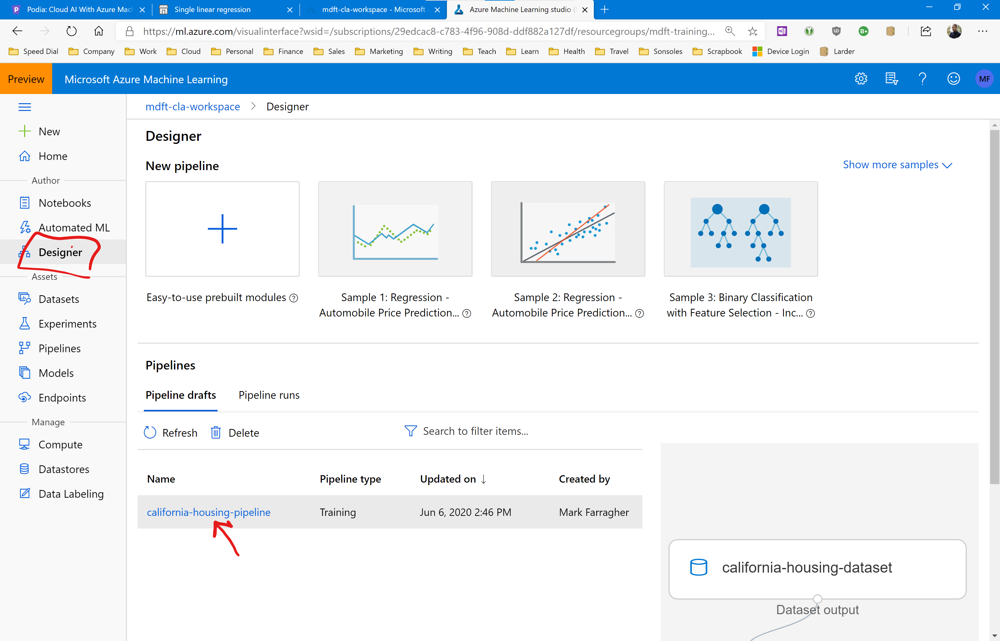
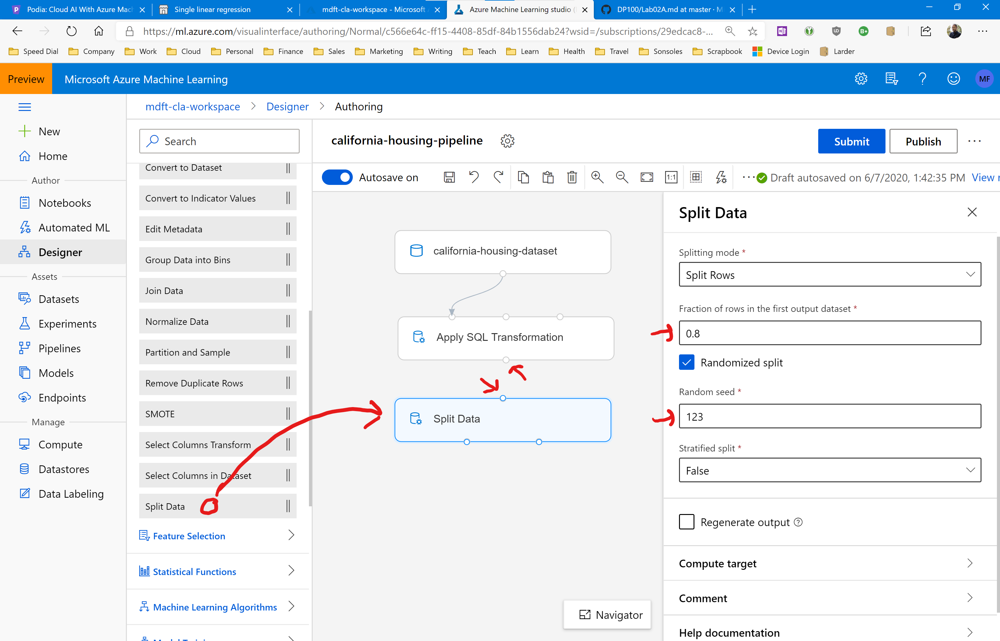
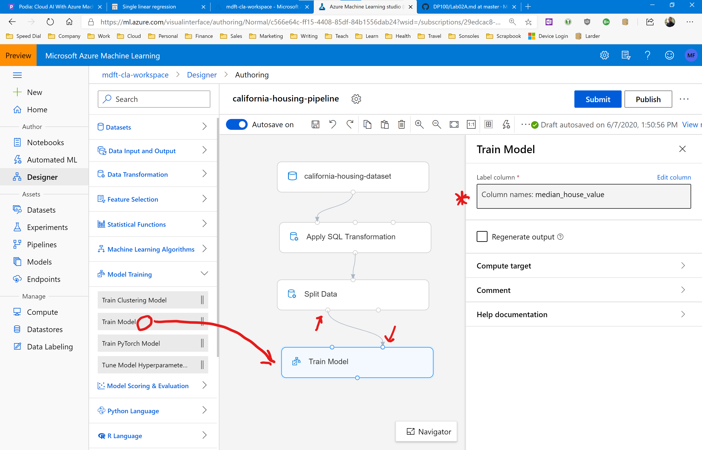
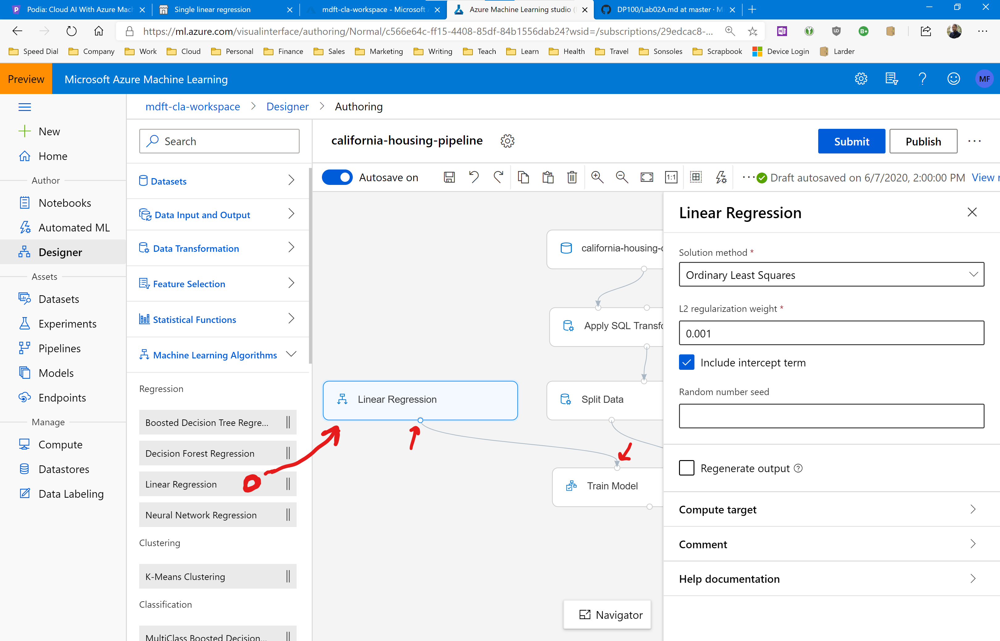
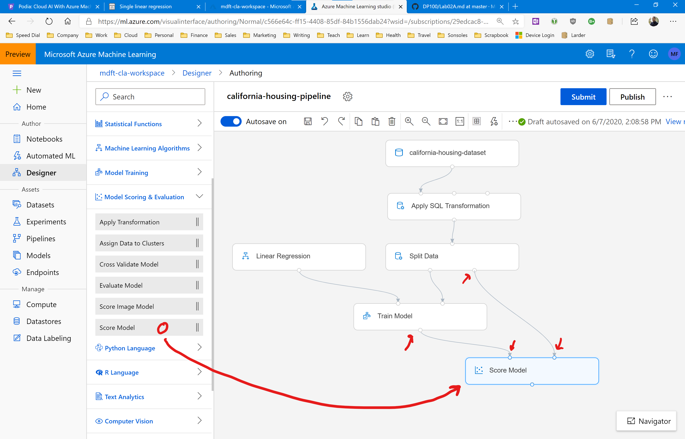
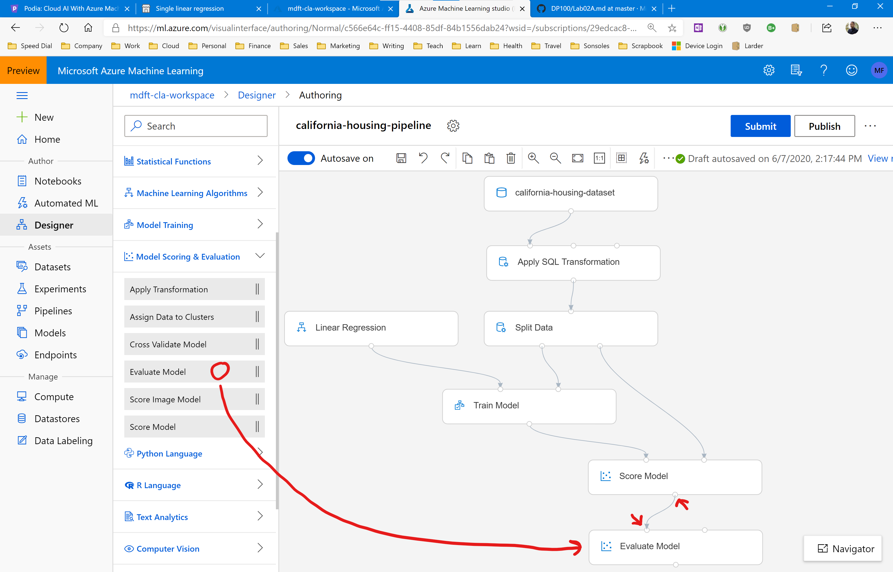
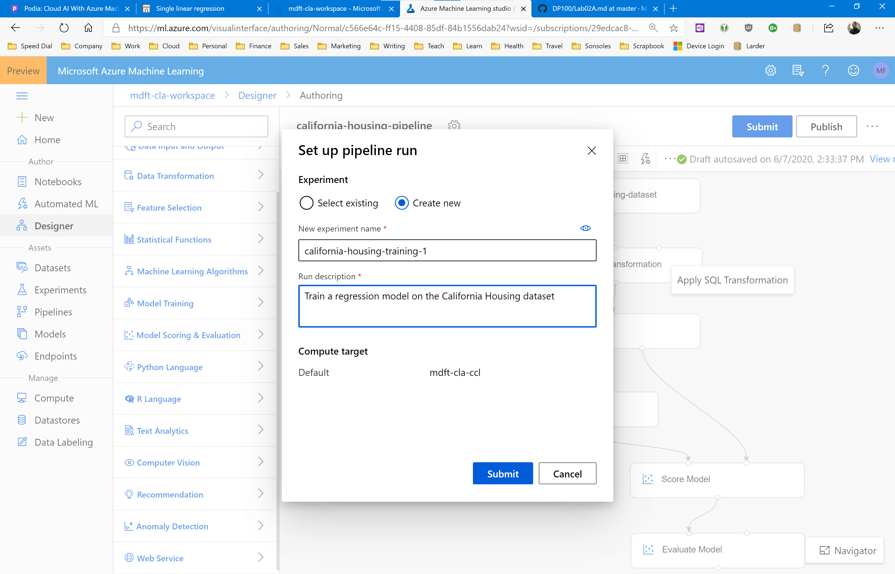
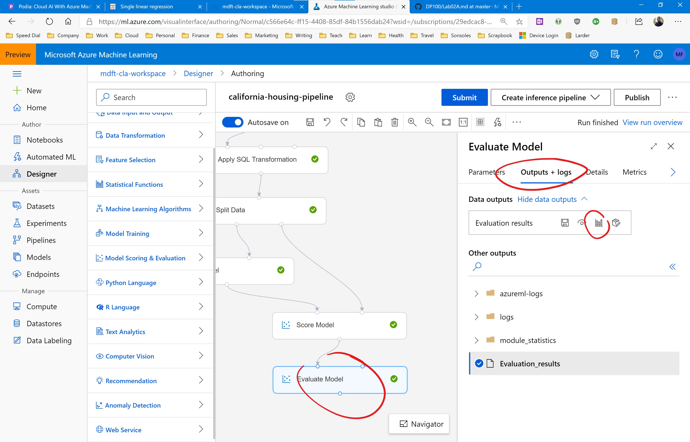

# Assignment: Predict house prices in California

In this assignment you are going to complete the California Housing pipeline you built earlier, and use it to train a machine learning model to make predictions of the median value of a house in the state of California.

We will then use the fully trained model to generate a bunch of predictions and compare them to the actual house values, and calculate evaluation metrics like the RMSE. 

You'll wrap up the assignment by reporting your RMSE in our Slack homework group. 

## Before You Start

Make sure you have set up the California Housing pipeline by following the instructions in the previous assignments. 

We will now expand on that pipeline and add machine learning training components.  

## Complete the California Housing pipeline

Let's get started. Your first task is to start the Azure Machine Learning designer and open the California Housing pipeline.

Open your Azure Machine Learning Workspace and click on the Designer link in the menu on the left. Then click on the california-housing-pipeline in the list of pipeline drafts:

This will open the pipeline designer.

The first thing you need to do is split the data into two sets: one for training the machine learning model, and one for testing the accuracy of the predictions of the fully-trained model.

This process is called **partitioning**. We will explore the how and why of partitioning in detail in an upcoming lesson. For now, just run with it. 

Open the Data Transformation group and drag the Split Data module onto the pipeline canvas. Connect its input to the output of the Apply SQL Transformation module.

Then enter the following in the information panel on the right:

* Splitting Mode: Split Rows
* Fraction of rows...: 0.8
* Randomized split: selected
* Random seed: 123
* Stratified split: False

What this does is randomize the data and then split the data into one set of 80% of all records, and a second set with 20% of all records. We will train on the 80% set and then test our predictions on the 20% set.

This 80/20 split is very common in machine learning and you will see it over and over again. 

Next, open the Model Training group and drag the Train Model module onto the pipeline canvas. Connect the **rightmost** input of the Train Model module to the **leftmost** output of the Split Data Module. 

What this does is feed the 80% set of our splitted data into the training module. We will hook up the 20% set later in this assignment. 

Now look at the information panel on the right. You need to specify the Label Column, this is the data column that contains the value that we want to predict. We're interested in predicting the median house values, so enter median_house_value here.

Your pipeline should now look like this:

Next, we need to specify a learning algorithm for this pipeline. We are going to use linear regression to train the mode, so open the Machine Learning Algorithms group and drag the Linear Regression module on the pipeline canvas.

Hook up the output of the Linear Regression module to the **leftmost** input of the Train Model module.

You can see from the design that the Train Model module receives the training algorithm on the left input, and the training data on the right input. The module will then produce a fully-trained model on its outpout. 

You can leave the properties of the Linear Regression module to their default values: using Ordinary Least Squares with a 0.001 L2 Regularization weight.

Next, we need to **score** the model. This means using the fully-trained model to generate predictions from the remaining 20% of the data that we haven't used yet. 

Open the Model Scoring & Evaluation group and drag the Score Model module onto the pipeline canvas. Then connect the **leftmost** input of the Score Model module to the output of the Train Model module.

Next, connect the **rightmost** input of the Score Model module to the **rightmost** output of the Split Data module.

You can see from the design that the Score Model module receives the fully-trained model on the left input, and the 20% data to use for scoring on the right input. The module will then produce a new dataset with extra columns at the end that contain the scoring predictions. 

You can leave the properties of the Score Model module to their default values.

We're almost done. The last step is to compare the scored predictions to the actual labels in the dataset, and then compute a bunch of evaluation metrics like the RMSE value. 

This will tell us how accurate the model predictions actually are, and if they're good enough to use in a commercial app. 

From the Model Scoring & Evaluation group, drag the Evaluate Model module onto the pipeline canvas and hook it up to the Score Model module. 

You'll notice that the Evaluate Model module has two inputs. This is for comparing two models trained on the same dataset. As we only use a single model in this assignment, use the leftmost input and leave the other one unconnected.

That's it! Your pipeline is now all done and ready to start.

Click on the blue Submit button in the top right of the page. Then provide the following information:

* Experiment: Create new
* New experiment name: california-housing-training-1
* Run description: Train a regression model on the California Housing dataset

And click the Submit button to start running the pipeline.

It will take about 5-10 minutes to train the model, score predictions, and compare the predictions with the labels in the dataset and calculate the evaluation metrics.

You'll be notified when the run completes. You'll see Run Complete appear in the top right of the page, and the Evaluate Model module will have a green checkmark indicating that it ran successfully. 

To view the evaluation results, click on the Evaluate Model module, and then in the information panel select the Output+Logs tab and click on the visualization icon:

What results do you get? What are your RMSE and MAE values? Is this a good result?

Now try to improve the model. Go to the Linear Regression module and set the solution method to Online Gradient Descent. Play around with the algorithm settings and rerun your pipeline. Can you improve your results?

Select the Apply SQL Transformation module and edit the SQL statement to remove any columns that you deem non-relevant to the price prediction. Rerun the pipeline and check the results. Did your RMSE improve or get worse? 

What's your best RMSE value?

Please share your results in our Slack homework group!
