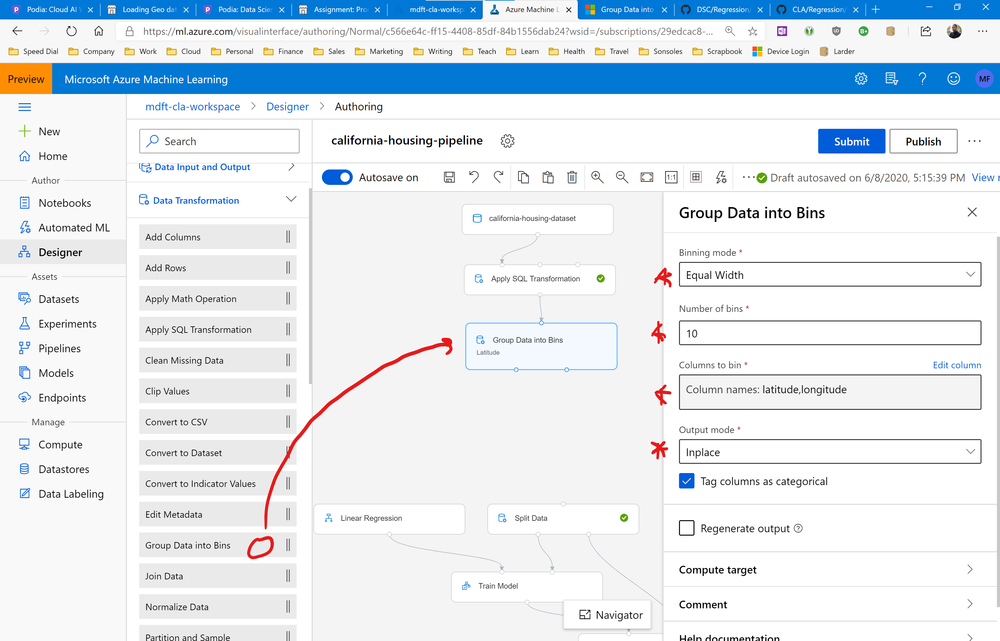

# Assignment: Improve the California Housing pipeline

In this assignment you are going to improve the California Housing pipeline you built earlier. You'll add extra modules for binning and one-hot encoding the latitude and longitude so that these columns are processed correctly.

You will then run the modified pipeline and check if the model evaluation metrics have improved. 

You'll wrap up the assignment by reporting your improved RMSE and MAE values in our Slack homework group. 

## Before You Start

Make sure you have a complete and working California Housing pipeline by following the instructions in the previous assignments. 

We will now expand on that pipeline and add binning and one-hot encoding modules.

## Improve the California Housing pipeline

Let's get started. Your first task is to start the Azure Machine Learning designer and open the California Housing pipeline.

We're going to add extra modules below the SQL Transformation module. So let's start by making some room.

Using the designer toolbar buttons, zoom out until you can see your entire pipeline. Then click the Multiple Select Mode button (3rd from the right on the toolbar) and drag to select everything in your pipeline below the SQL Transformation. Drag the selected components down to make room.

Your new layout should look something like this:

Now open the Data Transformation group and drag a Group Data Into Bins module onto the canvas. Connect the output of the SQL Transformation to the input of the Grouping module.

Configure the grouping as follows:

* Binning mode: Equal width
* Number of bins: 10
* Columns to bin: latitude, longitude
* Output mode: Inplace
* Tag columns as categorical: true

This will bin the latitude and longitude into 10 buckets, replacing the original columns. The new binned columns will be marked as categories meaning we can easily one-hot encode them later. 

Now drag a Convert To Indicator Values module on the pipeline canvas. Place it below the grouping module, and connect the **leftmost** output of the grouping module to the input of the Convert To Indicator Values module. 

Also connect the **leftmost** output of the Convert To Indicator Values module to the input of the Split Data module.

Then configure the Convert To Indicator Values module as follows:

* Categorical columns to convert: latitude, longitude
* Overwrite categorical columns: true

This will one-hot encode the binned latitude and longitude columns, replacing the original columns. 

That's it, your pipeline is done.

Run the pipeline in a new experiment, and check out the evaluation results after the run has completed.

What are your new RMSE and MAE values? Do you seen an improvement? Why do you think that is?

How could you improve these results even further? How would you configure the binning and one-hot encoding modules for even better results?

See if you can improve the model, and share your best results in our Slack homework group.
