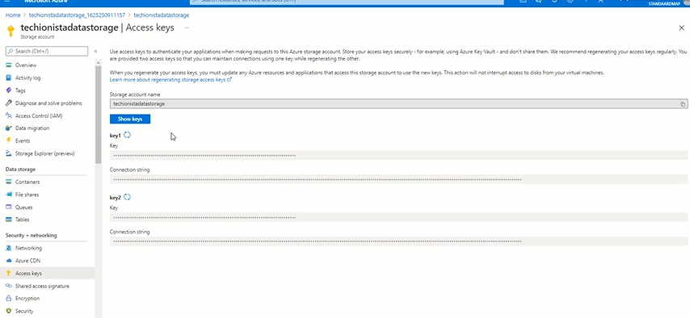

# Assignment: Set up the California Housing dataset

In this assignment you're going to load a dataset with the prices of houses in California into Azure.  

The first thing you'll need is a data file with house prices. The data from the 1990 California cencus has exactly what we need. 

Download the [California 1990 housing census](https://github.com/mdfarragher/DSC/blob/master/LoadingData/CaliforniaHousing/california_housing.csv) and save it. 

This is a CSV file with 17,000 records that looks like this:
 

The file contains information on 17k housing blocks all over the state of California:

* Column 1: The longitude of the housing block
* Column 2: The latitude of the housing block
* Column 3: The median age of all the houses in the block
* Column 4: The total number of rooms in all houses in the block
* Column 5: The total number of bedrooms in all houses in the block
* Column 6: The total number of people living in all houses in the block
* Column 7: The total number of households in all houses in the block
* Column 8: The median income of all people living in all houses in the block
* Column 9: The median house value for all houses in the block

We will load this data into Azure Machine Learning so that we can use the dataset later in the upcoming assignments.

## Before You Start

Make sure you have set up your Azure Machine Learning Workspace by following the instructions in the previous assignments.  

## Create an Azure Storage Account

Let's get started. Your first task is to set up an Azure Storage Account to hold all the data we're going to be using in this course. 

Go to your Azure portal page at https://portal.azure.com/. Click on the search field in the top blue bar and search for "storage accounts". Click on the Storage Accounts link in the search dropdown.

You'll be taken to the Azure Storage Accounts page. Click on the +Create button in the top left of the page:

We're going to create a simple storage account to hold all our machine learning data. Provide the following information:

* The Azure subscription in which you will place the storage account. Select your Azure Pass Sponsorship from the list.
* The resource group in which to place the storage account. Select the same resource group that is currently holding your Azure Machine Learning workspace.
* The storage account name. Type a nice name, for example 'techionistadatastorage'. Note that you cannot use dashes, underscores or spaces in the name.
* The location in which to place the storage account. Use the same location as where your Azure Machine Learning workspace is located.
* The performance level. Set this to Standard to save money.
* Redundancy. Set this to Locally-Redundant Storage (LRS).

Click the blue Review+Create button to confirm your choices and then click the blue Create button to create the storage account. This will take up to a minute. 

When the deployment confirmation appears, click on the Go To Resource button to navigate to the overview page of your new storage account. 

The page should look like this:

Now click on the 'Containers' menu option in the vertical menu on the left hand side of the page (you may have to scroll down a little). Click the link and you'll be taken to the containers overview page.

Click the +Container button and provide the following information:

* The name of the container to create. Fill in "california-housing-data" here.
* The access level of the container. Set this to Private.

Click the blue Create button to confirm your choices and create the new container.

When the container appears in the list, click on it. Then click the Upload button to upload the California Housing datafile into the container. In the panel on the right hand side of the page, click the small blue browse button to select the datafile from your local computer. Then click the blue Upload button to start the upload. 

You now have a new storage account with a data container that holds the California Housing data. We are almost ready to bring this data into the Azure Machine Learning Workspace, there's one more thing to do.

## Write down the storage account key

In the breadcrumb at the top of the page, click on the last entry in the breadcrumb. This is the link with the name of your storage account. 

Clicking the link will take you back to the overview page of your storage account:

In the vertical menu on the left hand side of the page, locate the menu entry named 'Access keys' and click on it.

Now click on the blue 'Show keys' button to reveal the two access keys: key1 and key2. Copy the value of key1 and store it somewhere safe. For example, you can open an empty notepad window and paste the key in there.

We are going to need this key in a couple of minutes. 

## Create an Azure ML Datastore

Now we're now going to make the new storage account available in the Azure Machine Learning workspace as a datastore.

Go back to the Azure Machine Learning Studio and click on the Datastores link in the vertical menu on the left hand side of the page. You'll see the datastores overview page which will look like this:

Click on the +New Datastore link to create a new datastore. Provide the following information:

* The datastore name. Set this to "california_housing_data".

* The datastore type. Select Azure Blob Storage.
* The account selection method. Select From Azure Subscription.
* The subscription ID. Select your Azure Pass Sponsorship from the list.
* The storage account. Select the account that you just created in the previous step. 
* The blob container. Select the container that you just created in the previous step.
* Save credentials... Make sure this field is set to 'Yes'.
* Authentication type. Set this to Account Key.
* Account key. Paste the key1 value of the storage account here that you stored in notepad in the previous step.

Then click the blue Create button to create the datastore.

You'll see a message that the datastore was successfully created, and it will appear in the list of stores:

## Create an Azure ML Dataset

Our final step is to set up the California Housing dataset in our Azure Machine Learning Workspace. 

Go to the vertical menu on the left hand side of the page and click the 'Datasets' menu option. Then click on the +Create Dataset button, and then select "From Datastore" from the dropdown menu.

In the next page, provide the following information:

* The name of the dataset to create. Fill in "california-housing-dataset" here.
* The type of the dataset. Since we're working with a comma-separated datafile, the type should be set to Tabular.
* A description of the dataset. You can leave this field blank.

Note that the dataset also has a version number which is set to 1. If we decide to load more data later on, or change the existing data, the version number will automatically increment. 

Click the blue Next button at the bottom of the page to continue to the next step. 

Now you need to select the datastore which contains the data to load. Select the datastore you created previously: california_housing_data.

You also need to provide a path specification that determines which files to load into this dataset. You can specify subfolders and wildcard characters here.  

Note that there's also a special "/**" wildcard that will load all files in all subfolders into the dataset.  

Our datastore only contains one csv file in the root folder, so you can just enter a single * wildcard here.

Leave everything else at their default values and click the blue Next button to continue. 

Azure Machine Learning will now scan the files in the datastore and attempt to determine the file format. You'll see the following information appear:

* File format: Delimited. This is correct.
* Delimiter: Comma. This is correct.
* Encoding: UTF-8. This is correct.
* Column headers: None. This is not correct, our file has the column headers in the first row. So change this field to: All files have same headers.
* Skip rows: None. This is correct.

You can see a preview of the first few lines of the file at the bottom of the page. Note how all the columns appear with their data and headers. This indicates that the file is being parsed correctly.  

Click the blue Next button to continue. 

You're now seeing a list of data types for each column in the file. Azure Machine Learning has determined that all columns hold Decimal data. This is correct, so we don't need to change anything.  

Also note the Include switches for each column. By toggling these switches, we can decide which columns get included in the dataset. 

Note that there is an initial column called Path (which will not be included). This column contains the full path of the file that contains the record.

As we're working with only a single datafile here, this is not very useful right now. But you can use this column in scenarios where you are loading data from many different csv files and you need to keep track from which source file each record originated.

Click the blue Next button at the bottom of the page.

The dataset is now fully configured and Azure Machine Learning shows a summary of all settings. You can double-check that you entered everything correctly and then click the blue Create button to create the dataset.

The dataset will now be created. After a few seconds the overview page appears, with a green notification that the dataset has been created successfully. The California housing data should now also appear in the list of datasets.

Your overview page will look like this:

Congratulations! You have successfully set up the California Housing dataset, and we are now ready to start training machine learning models with this data.

We will use this dataset in later assignments.

