# Assignment: Set up Azure Machine Learning Studio

In this assignment you will set up the Azure Machine Learning workspace that you will use throughout the rest of this training.

## Before You Start

To complete the assignments in this course, you will need an Azure subscription. If you do not already have one, you can sign up for a free trial at [https://azure.microsoft.com](https://azure.microsoft.com). Check out the course prerequisites section for a detailed walkthrough on how to create a new Azure subscription. 

## Create a new Azure Machine Learning Workspace

Let's get started. Your first task is to set up an Azure Machine Learning Workspace. This is a centralized place to manage all of the Azure machine learning resources you need to work on a project.

Go to your Azure portal page. It should look something like this:

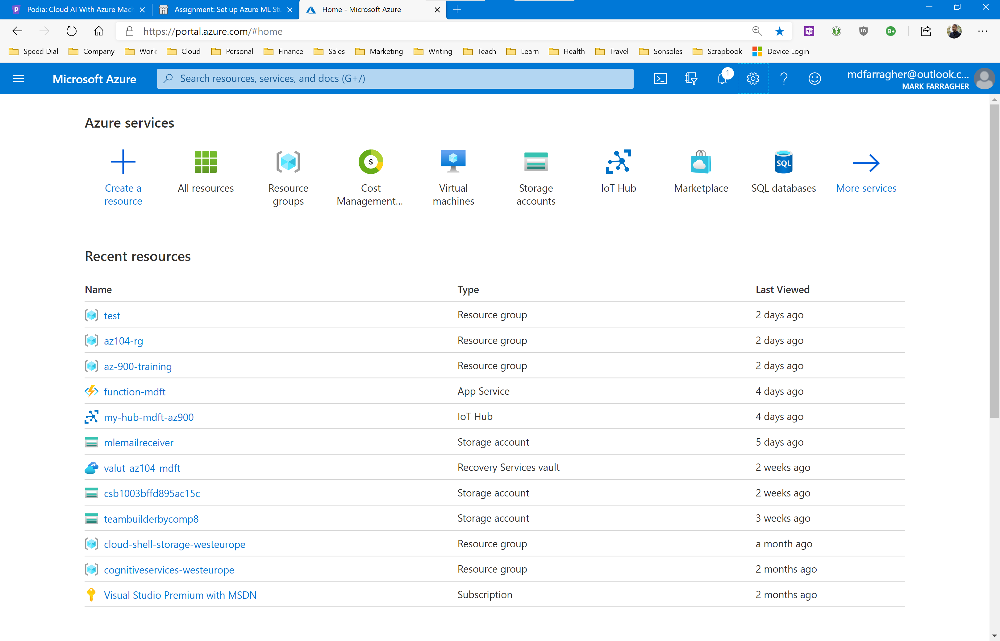

This is a screenshot of my own Azure portal, yours will have a different list of Azure services and recent resources. 

Now click the Create A Resource button (with the blue plus sign icon) and search for "machine learning". Select the Machine Learning result from the dropdown list:

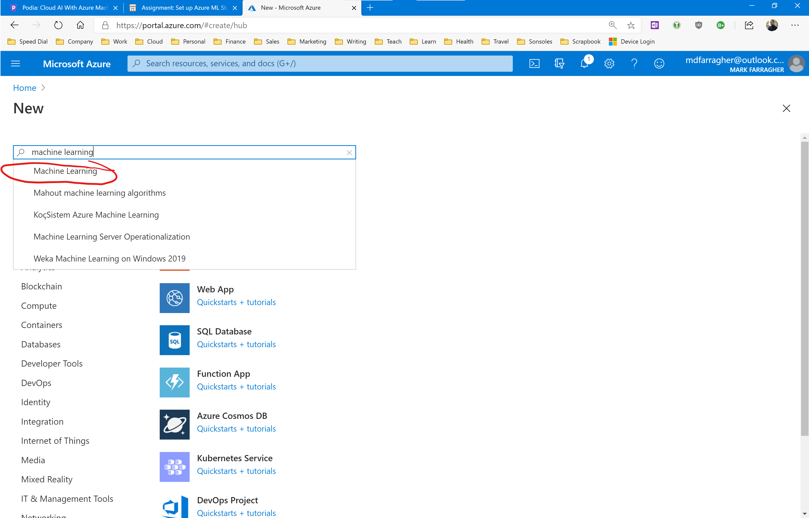

You'll see an overview page with information about Azure Machine Learning. 

Click the Create button to confirm your choice:

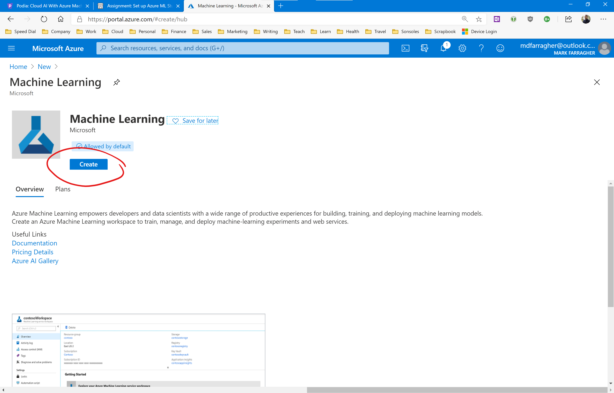

Now create a new machine learning workspace and provide the following details:

* The name of the machine learning workspace. 
* The Azure subscription in which you will place the workspace. 
* The resource group in which you will place the workspace. It's a good idea to create a new resource group for this training and give it a descriptive name, for example: 'cloud-ai-resources'. 
* The location in which to place the workspace. This corresponds to the Azure datacenter that will host your machine learning files. Choose a location that's closest to where you are working to minimize latency.
* The workspace edition. Here you'll need to select 'Enterprise' because we will be using the visual model designer in this course, and the designer is only available in the enterprise edition.

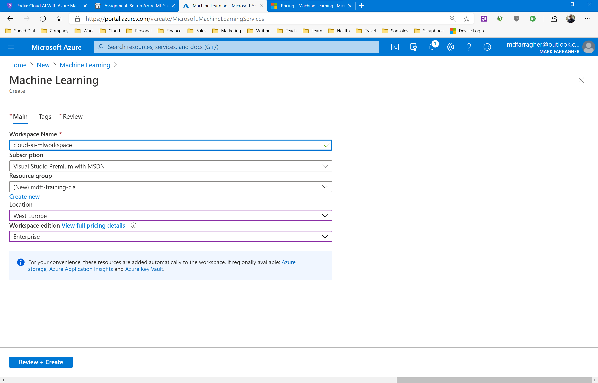

Now click the Review+Create button, and then click Create. Your machine learning workspace will now be deployed. This can take a couple of minutes.

After deployment is complete, you'll be notified like this. Click the Go To Resource button to access your new workspace.

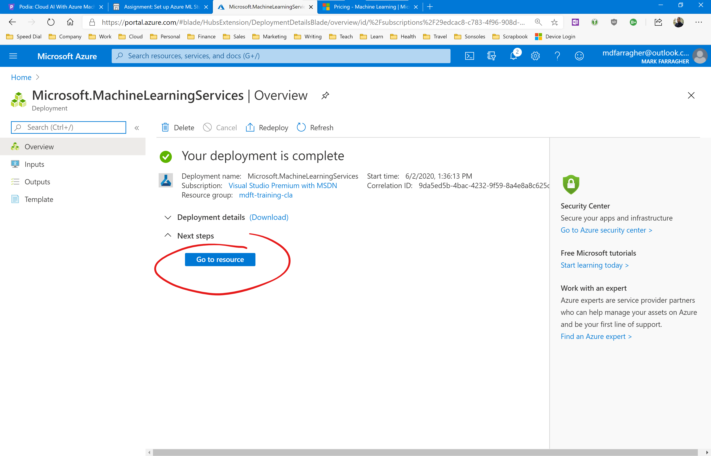

## Access the Azure Machine Learning Studio interface

You can now manage your workspace in the Azure portal, but it contains lots of information that's specifically intended for cloud administrators.

For us machine learning practicioners Microsoft has provided a much better web interface that's specially designed for managing machine learning resources. This interface is called the Azure Machine Learning Studio. 

You can access the studio interface by clicking this button:

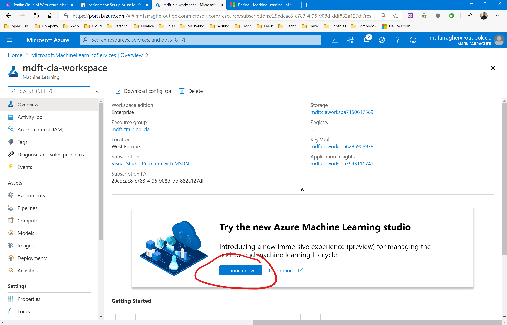

This will launch the Azure Machine Learning Studio. 

You'll have to provide your subscription, resource group, and workspace name again. Just select the same values you entered previously when creating the workspace. 

You're now looking at the Azure Machine Learning Studio interface. We will be spending most of our time here while we work through the assignments in this course. 

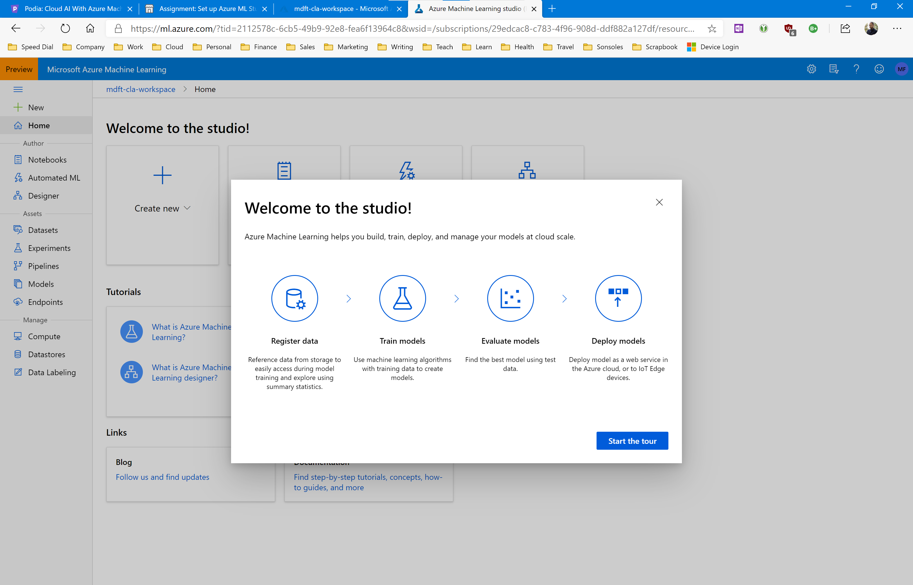

## Create a Compute Instance

Azure Machine Learning Studio uses 'compute resources' to train and run machine learning models. These are clusters of virtual machines that work together to efficiently train and run very large ML models. You can create as many clusters as you like, and each cluster can have as many virtual machines as you like. Depending on the size of the training job, Azure Machine Learning will automatically boot up more VMs to the cluster to handle the load.

For this training you will need only a tiny cluster. We will limit the total number of virtual machines to 2 to keep costs down. 

To get started, you'll need to set up the following:

* A Compute Instance. This is a single virtual machine that hosts a Jupyter Labs installation that provides a cloud-based Python notebook environment for machine learning practicioners. We can also train small machine learning models with this single virtual machine.

* A Compute Cluster. This is a scalable cluster of multiple virtual machines that can be used to train large-scale machine learning models. 

Let's set up both of them right now. 

In the Azure Machine Learning Studio you'll notice a menu bar on the left. In this menu click on the Compute link (it's in the Manage section near the bottom). 

You're now on the compute page. You'll notice that there are no compute instances configured yet and the list is empty. 

Make sure the Compute Instance tab is selected, and then click on the New button:

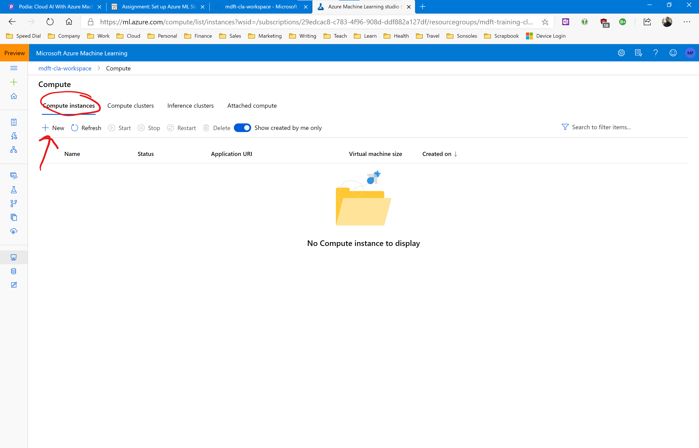

To create a new compute instance, specify the following:

* The name of the new compute instance.
* The virtual machine type, this can be either CPU or GPU. Select CPU for this training to keep costs low. 
* The virtual machine size. Select the smallest available size D1. The virtual machine will have only one virtual CPU core and 3.5 gigabytes of RAM, this again keeps costs low. 

Note that we're selecting the smallest possible virtual machine size for this training in order to keep daily costs as low as possible. For large-scale professional machine learning projects, you would probably select the GPU virtual machine type and a much larger size. But keep in mind that this will also be significantly more expensive.  

Leave all other settings at their default values and click the blue Create button.

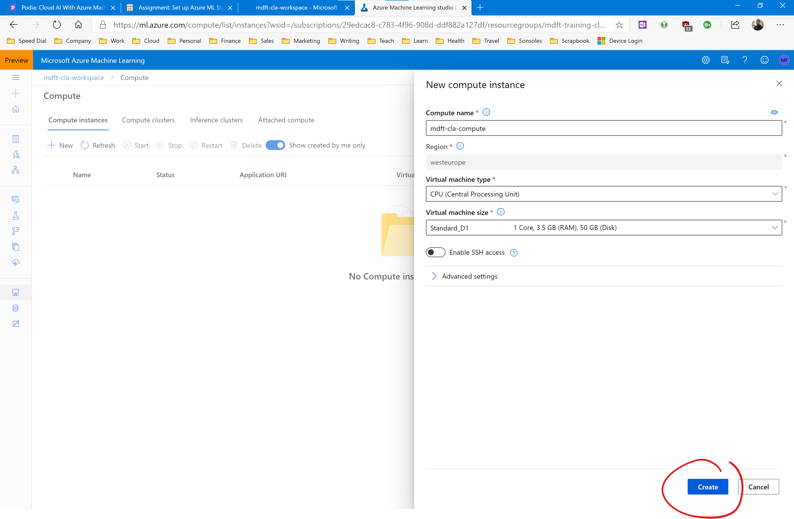

The compute instance will now be created. This can take a couple of minutes, so while we're waiting, we are going to set up a compute cluster as well.

## Create a Compute Cluster

Make sure you select the Compute Cluster tab at the top of the page, and then click the New button. 

We're going to set up a new cluster by providing the following information:

* The name of the new compute cluster.
* The virtual machine type. Just like with the compute instance, select the CPU type here.
* The virtual machine priority. Set this to Low Priority to save money. The downside is that training runs will now take longer because other Azure users might pre-empt our cluster for their jobs.
* The virtual machine size. We are again going to use the D1 size which gives us 1 virtual CPU core and 3.5 GB of RAM for each virtual machine in the cluster.
* Minimum number of nodes. Set this to zero to ensure that all virtual machines in the cluster shut down when we are not training models.
* Maximum number of nodes. Set this to 2, so that during peak load we never have more than two virtual machines running.
* Idle seconds before shut down. Set this to 120 seconds. If we are not using our cluster for more than two minutes, it will automatically shut down. 

You can see that we're again selecting values to keep costs as low as possible. This will work fine in this course, but you will probably select more generous settings for your own large-scale machine learning projects. 

Click the blue Create button to set up the cluster. 

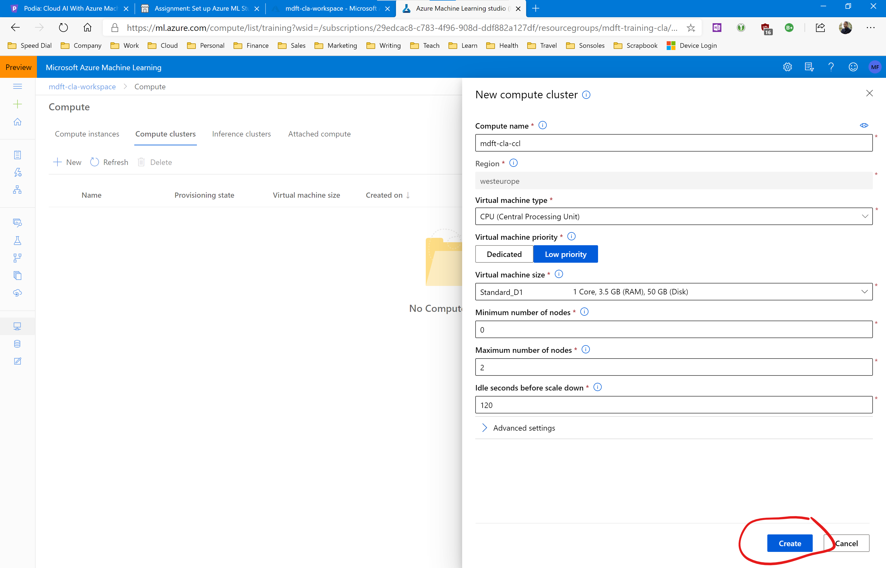

After a couple of minutes, both the compute instance and the compute cluster will be running. You should see a green Running indicator on both the Compute Instance and Compute Cluster tabs:

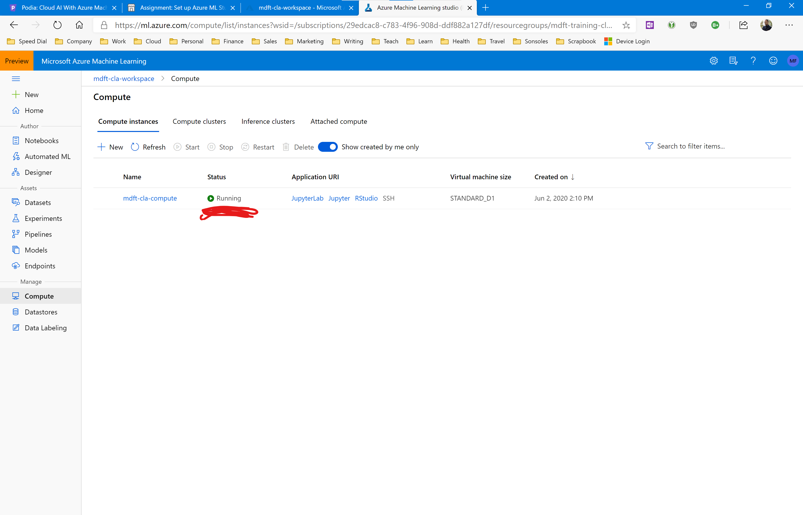

Congratulations! Your Azure Machine Learning Studio is now fully operational. We will use these compute resources in the upcoming course assignments to build, train, and run several cool machine learning models. 
 