# Assignment: Build an Azure Machine Learning Pipeline

In this assignment you are going to build an Azure Machine Learning pipeline that loads the California Housing dataset and transforms any columns that require extra processing. Our objective is to get the data ready for machine learning training. 

In upcoming sections, you will complete this pipeline by adding additional machine learning training and scoring components. 

## Before You Start

Make sure you have set up the California Housing dataset by following the instructions in the previous assignments.  

## Create a new Azure Machine Learning pipeline

Let's get started. Your first task is to start the Azure Machine Learning designer and use it to create the pipeline.

Go to your Azure Machine Learning workspace and click the Designer link in the menu on the left. You'll be taken to the pipeline overview page:

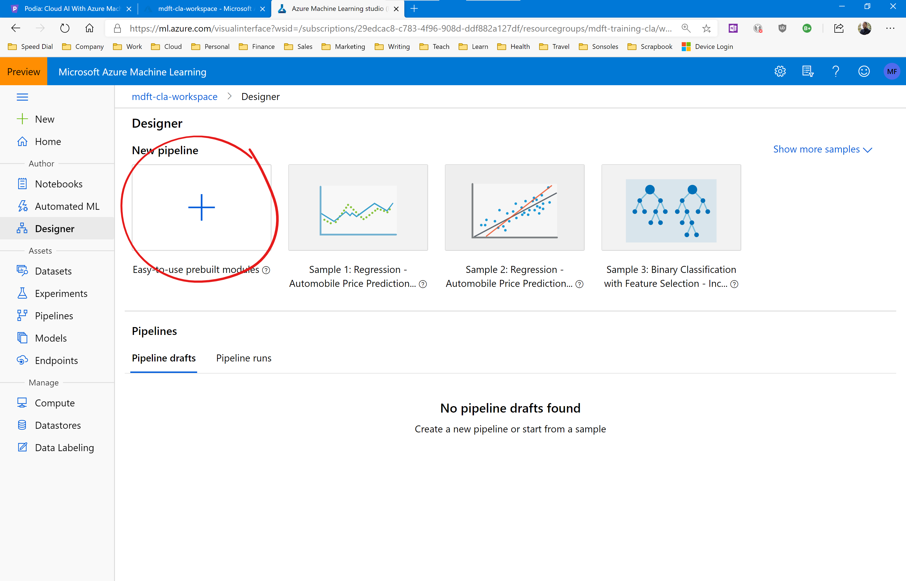

Click the big + button in the top left of the page to create a new pipeline. 

The graphical pipeline designer will open. You'll see a prompt to specify the compute target. This is the virtual machine instance or cluster that the pipeline will run on. 

Click the 'Select Compute Target' link and specify the virtual machine cluster you set up earlier. 

Then change the default name and description of the pipeline. Name the pipeline 'california-housing-pipeline' and change the description to: 'Train a model on the California housing dataset'.

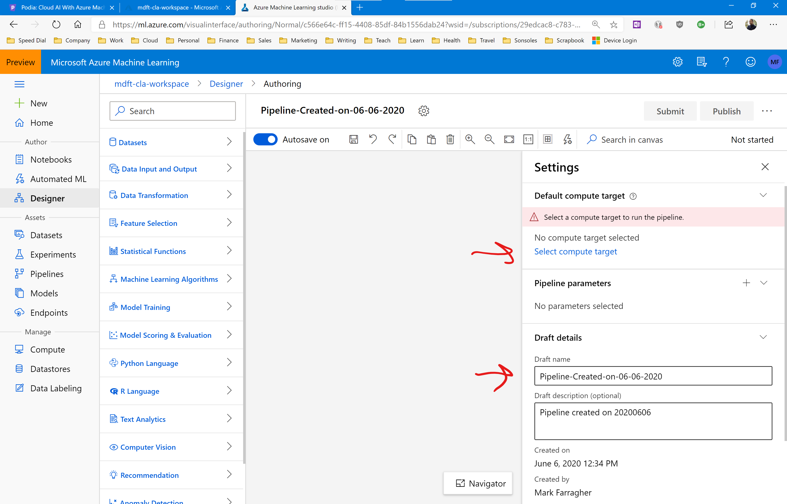

Now let's start building the pipeline. We want to start by loading the California Housing dataset.

Click on the Datasets link in the menu on the left, and drag the california-housing-dataset onto the pipeline canvas like this:

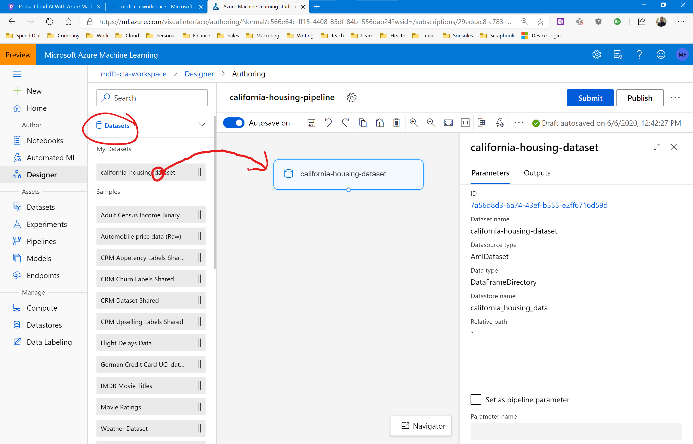

An information panel will open on the right of the page with details about the dataset module. 

You can quickly inspect the data by clicking on the Output tab and then clicking the graph icon:

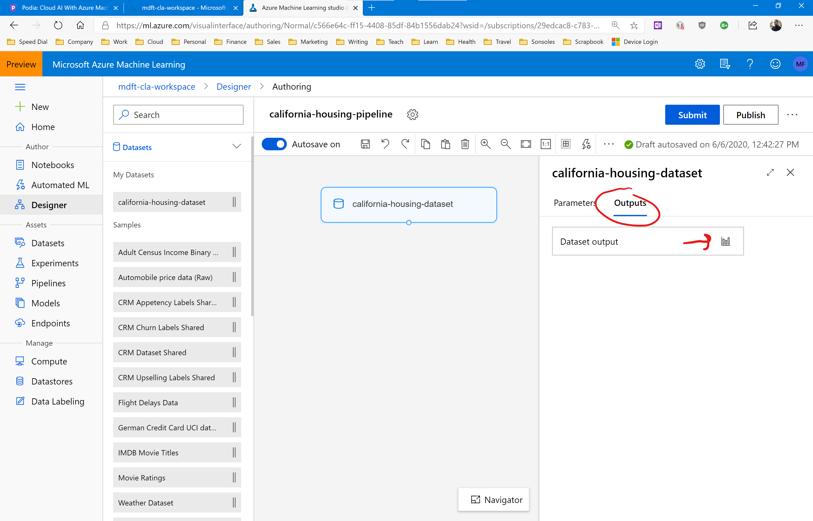

This will open the dataset explorer and display interesting statistics about the data columns, just like when we generated the dataset profile. 

Click on the total_rooms column. Notice the max value (37937) and the histogram with the long tail of outliers. Clearly there's something strange going on with this column. Some of the housing blocks have almost 38,000 rooms! 

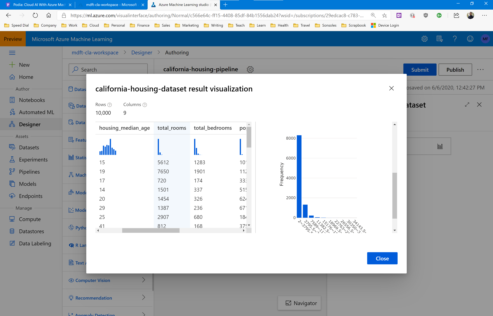

These outliers are probably hotels. Unfortunately they are going to mess up our training if we want to use this data to predict residential housing block prices. 

The population column has the same issue. The housing block with the largest population has 35,682 people living in it and the histogram also shows a massive long tail.  

We also have the median_house_value column which is on a numeric range from 15,000 to 500,000. This is significantly larger than any of the other columns, and we run the risk of having our machine learning algorithm prioritising the median house value over all other data columns.

To fix these issues, we're going to do the following:

* Divide the total_rooms column by the population column to generate a new data column called rooms_per_person. This is the average number of rooms available to each person in a housing block.
* We will keep all records with a rooms_per_person value of 4 or less, and discard all records with more than four rooms per person.
* We will divide the median_house_value column by 1,000 to bring its numeric range in line with the other columns.

We can achieve all of these transformations with a single module. 

Click on the Data Transformation group and drag the Apply SQL Transformation module onto the pipeline canvas:

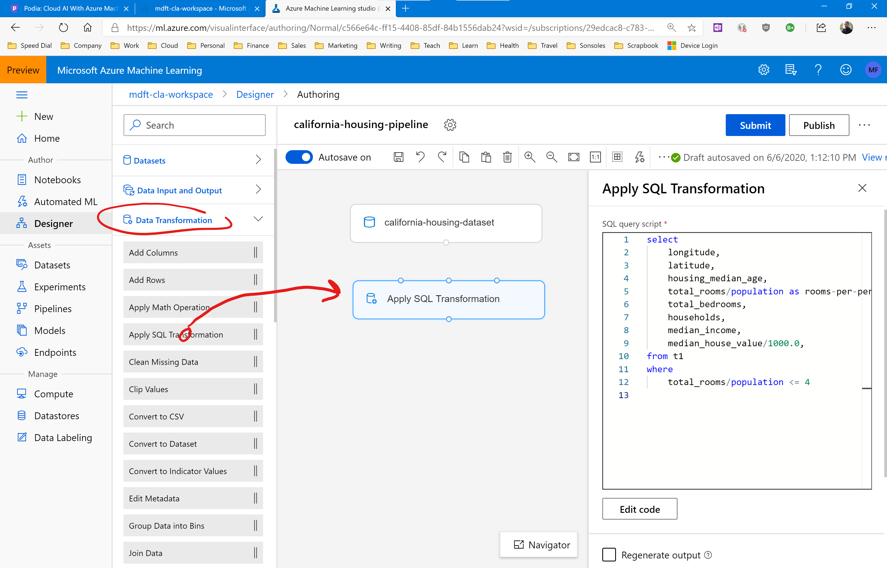

Connect the dataset and the SQL transformation modules together. Drag the bottom circle of the california-housing-dataset module on to the top-left circle of the Apply SQL Transformation module, like this:

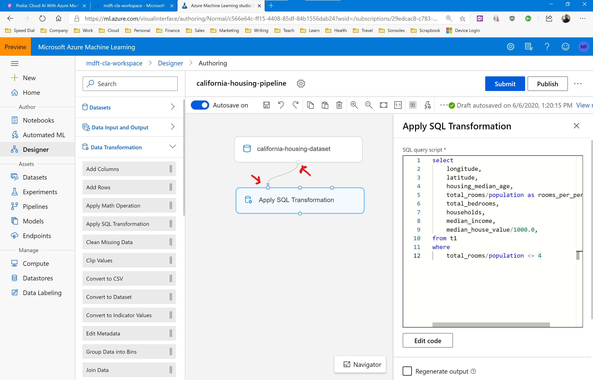

Now enter the following SQL query in the information panel on the right: 

```
select 
    longitude,
    latitude,
    housing_median_age,
    total_rooms/population as rooms_per_person,
    total_bedrooms,
    households,
    median_income,
    median_house_value/1000.0 as median_house_value
from t1
where
    total_rooms/population <= 4
```

This SQL statement sets up a new column called rooms_per_person, and it divides the median house value by 1,000. The WHERE statement keeps only the records with 4 or less rooms per person and discards everything else.

Now we're ready to test this pipeline and check if everything works. 

Click on the blue Submit button in the top right. This will start a new experiment and run the pipeline. 

Provide the following information:

* Experiment: Create new
* New experiment name: california-housing-transformation
* Run description: Test the SQL data transformation

And click the blue Submit button to start the run.

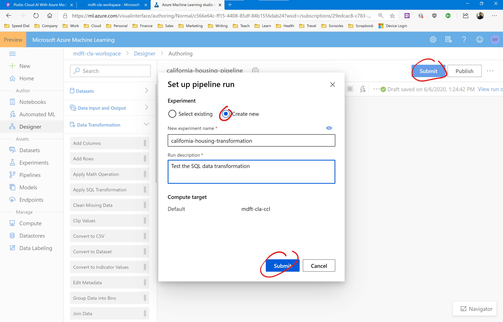

While the pipeline is running, you'll see the run status in the top right of the pipeline designer page. 

Wait for the status to be completed. This can take a couple of minutes. 

When the run has completed, you'll see the status 'Run Finished' in the top right of the page. The Apply SQL Transformation module will also have a green checkmark to indicate that it has run successfully:

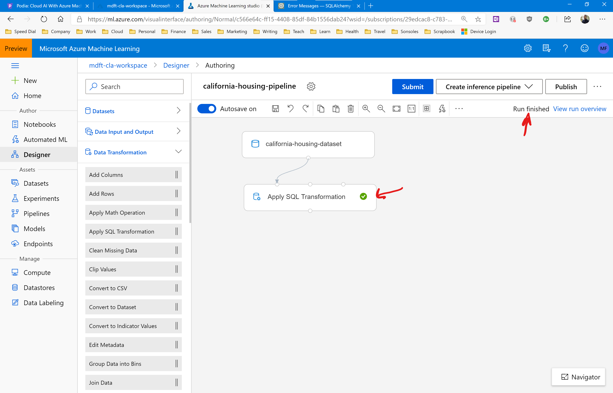

You can now click the Apply SQL Transformation module again. You'll notice in the information panel on the right that there is an 'Output + Logs' tab. 

Click the tab and then click the visualize icon in the Result_dataset box. 

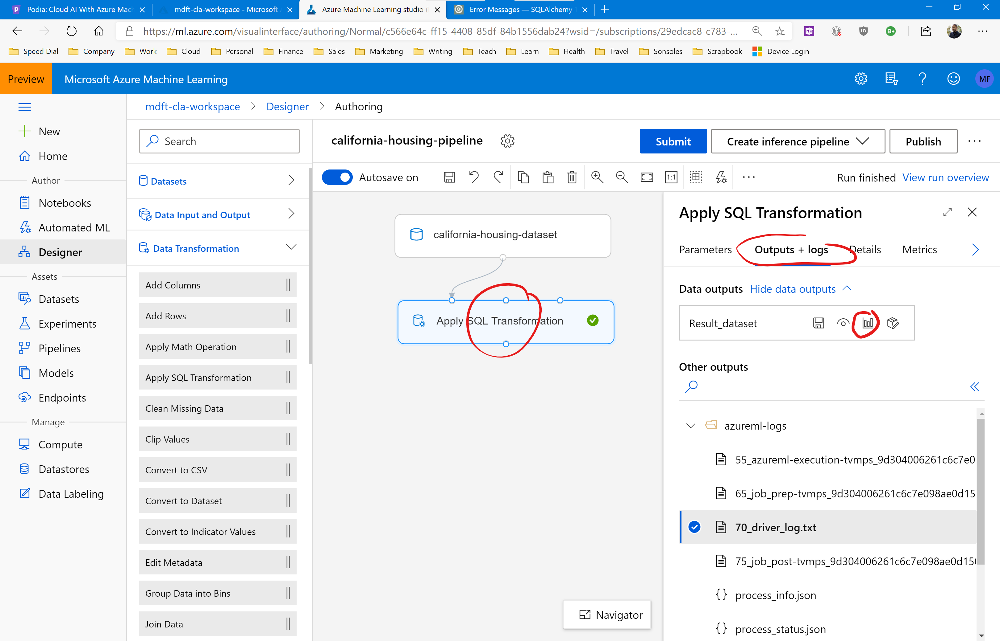

You'll see the same data explorer pop up that we saw previously when testing the dataset module. 

But now notice the columns. Do you see the new rooms_per_person column? Notice the nicely balanced normal distribution in the histogram, this is proof that our scrubbing tactic has worked.

Also check out the median_house_value column and notice that all values have been divided by 1,000. 

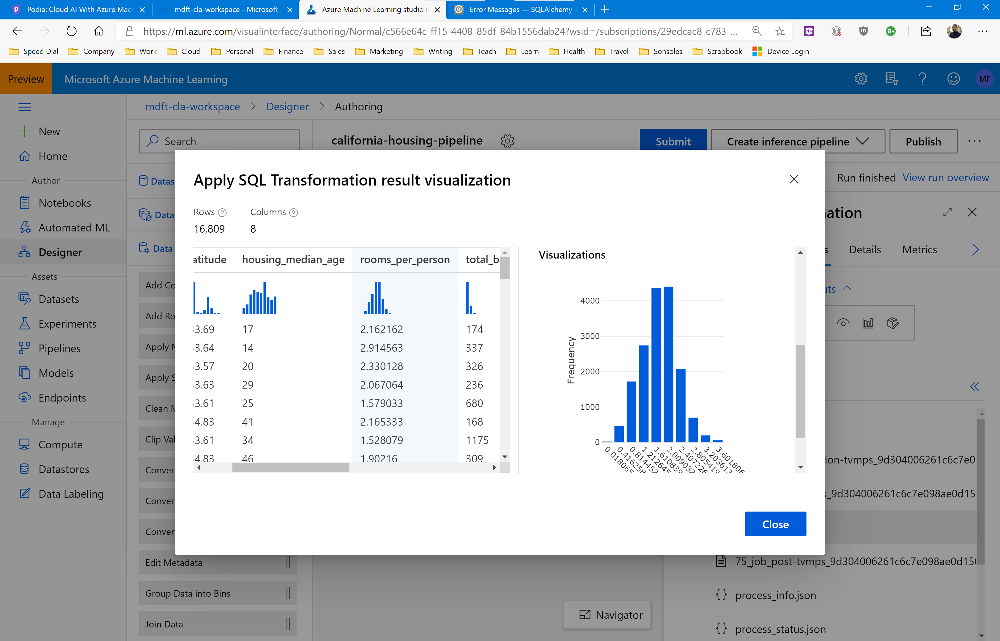

Congratulations! You have successfully prepared the California Housing dataset for machine learning training. 

In the next section, we will expand on this pipeline and add modules that train a machine learning model to predict house prices. 